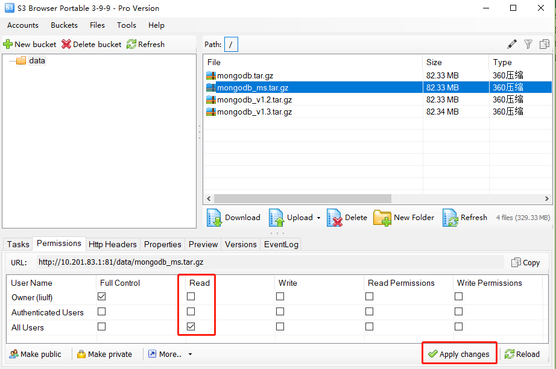
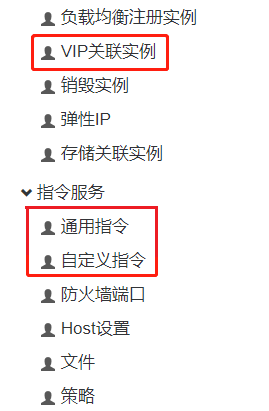
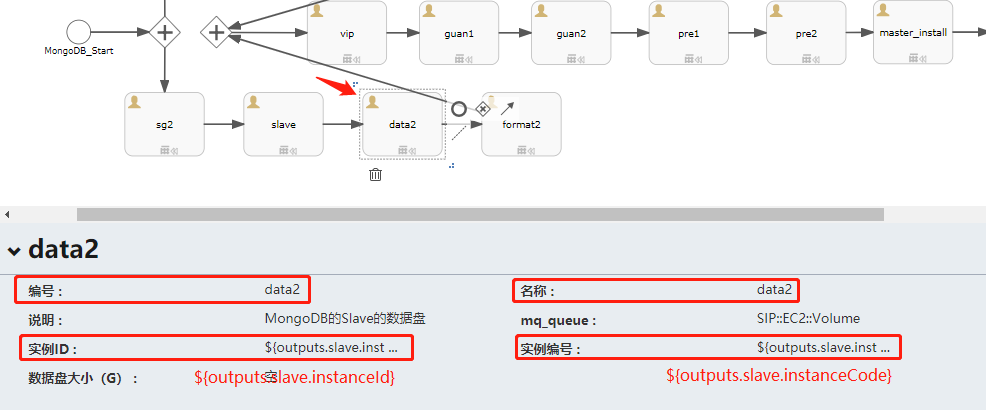
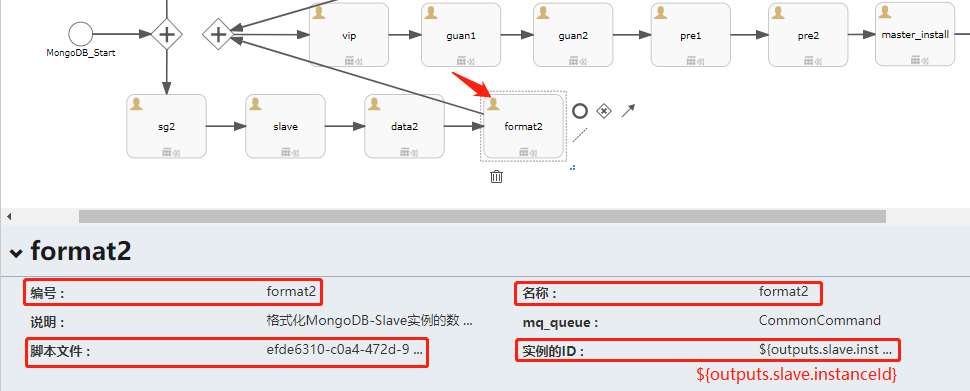
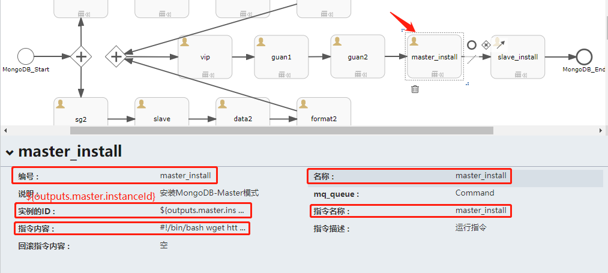
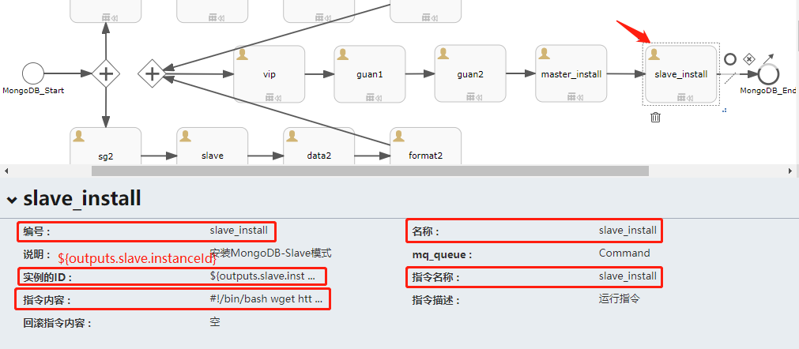
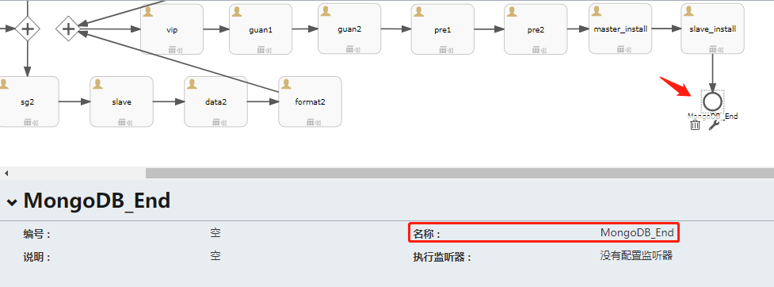
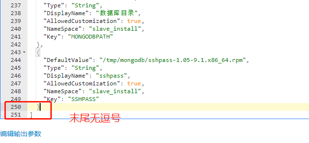

# 制作主从模式的MongoDB应用
&emsp;&emsp;本教程是面向熟悉使用SIP4.1的管理人员，需要具备看懂简单Shell脚本的能力，对SIP4.1自动化部署流程有一定的了解。若您对SIP4.1不了解，建议先学习“SIP4.1使用手册”。  
> SIP4.1使用手册（sip_user_guide_v4.1.0.20180930）：  
> http://  

### 一、安装包准备和上传
1、下载MongoDB安装程序和脚本。  
> MongoDB安装程序(mongodb_ms.tar.gz)：  
> http://  
> MongoDB-Master安装脚本(install_mongodb_master.sh)：  
> https://github.com/bcdelivery/autodeploy/blob/master/scirpts/install_mongodb_master.sh  
> MongoDB-Slave安装脚本(install_mongodb_slave.sh)：  
> https://github.com/bcdelivery/autodeploy/blob/master/scirpts/install_mongodb_slave.sh  

2、将下载好的MongoDB安装程序(mongodb_ms.tar.gz)上传到s3，设置所有人权限可读，记录url。  




### 二、设计方案

1、在窗口的左边有许多控件，那是“控件菜单”，从左拖拽如下图所示的控件到编辑区，然后根据下图的箭头顺序依次将控件之间的关系指引起来：  




2、点击“开始事件”，根据需要填写控件的相关信息：  
注意：红色方框内的内容必填，名称建议用英文表示。  


3、点击“安全组sg1”，根据需要填写控件的相关信息：  
注意：红色方框内的内容必填，编号、名称都用英文表示。  


4、点击“安全组sg2”，根据需要填写控件的相关信息：  


5、点击“实例master”，根据需要填写控件的相关信息：  
注意：红色方框内的内容必填，编号、名称、实例名称都用英文表示。  


6、点击“实例slave”，根据需要填写控件的相关信息：  
注意：红色方框内的内容必填，编号、名称、实例名称都用英文表示。  


7、点击“存储data1”，根据需要填写控件的相关信息：  
注意：红色方框内的内容必填，编号、名称都用英文表示，**实例ID**和**实例编号**中的填写格式是：  
> 实例ID：${outputs.<font color=#7FFF00>master</font>.instanceId}  
> 实例编号：${outputs.<font color=#7FFF00>master</font>.instanceCode}  
绿色标记的是**“实例master”控件**中的**“编号”**，必须一致。  


8、点击“存储data2”，根据需要填写控件的相关信息：  
注意：红色方框内的内容必填，编号、名称都用英文表示，**实例ID**和**实例编号**中的填写格式是：  
> 实例ID：${outputs.<font color=#7FFF00>slave</font>.instanceId}  
> 实例编号：${outputs.<font color=#7FFF00>slave</font>.instanceCode}  
绿色标记的是**“实例slave”控件**中的**“编号”**，必须一致。  



9、点击“通用指令format1”，根据需要填写控件的相关信息：  
注意：红色方框内的内容必填，编号、名称都用英文表示，**实例ID**的填写格式是：  
> 实例ID：${outputs.<font color=#7FFF00>master</font>.instanceId}  
绿色标记的是**“实例master”控件**中的**“编号”**，必须一致。  


10、点击“脚本文件”，选择格式化挂载存储卷的脚本**linux_volume_attach**：  


11、点击“通用指令format2”，根据需要填写控件的相关信息：  
注意：红色方框内的内容必填，编号、名称都用英文表示，**实例ID**的填写格式是：  
> 实例ID：${outputs.<font color=#7FFF00>slave</font>.instanceId}  
绿色标记的是**“实例slave”控件**中的**“编号”**，必须一致。  



12、点击“脚本文件”，选择格式化挂载存储卷的脚本**linux_volume_attach**：  


> linux_volume_attach脚本相关变量备注：  


13、点击“vip”，根据需要填写控件的相关信息：  
注意：红色方框内的内容必填，名称建议用英文表示。  


14、点击“vip关联实例guan1”，根据需要填写控件的相关信息：  
注意：红色方框内的内容必填，编号、名称都用英文表示，**vipId**和**实例ID**的填写格式是：  
> 实例ID：${outputs.<font color=#7FFF00>master</font>.instanceId}  
> vipId：${outputs.<font color=#7FFF00>vip</font>.vipId}  
绿色标记的分别**“vip”控件**中的**“编号”**、**“实例master”控件**中的**“实例ID”**，必须一致。  


15、点击“vip关联实例guan2”，根据需要填写控件的相关信息：  
注意：红色方框内的内容必填，编号、名称都用英文表示，**vipId**和**实例ID**的填写格式是：  
> 实例ID：${outputs.<font color=#7FFF00>slave</font>.instanceId}  
> vipId：${outputs.<font color=#7FFF00>vip</font>.vipId}  
绿色标记的分别**“vip”控件**中的**“编号”**、**“实例slave”控件**中的**“实例ID”**，必须一致。  


16、点击“自定义指令master_install”，根据需要填写控件的相关信息：  
注意：红色方框内的内容必填，编号、名称都用英文表示，**实例ID**中的填写格式是：  
> 实例ID：${outputs.<font color=#7FFF00>master</font>.instanceId}  
绿色标记的是**“实例master”控件**中的**“实例ID”**，必须一致。  



17、点击“指令内容”，输入：（install_mongodb_master.sh）  
```
#!/bin/bash
clear
wget http://10.201.83.1:81/data/mongodb_ms.tar.gz -O /tmp/mongodb_ms.tar.gz
tar -zxvf /tmp/mongodb_ms.tar.gz -C /tmp
echo "tar done"
clear
# Some functions to make the below more readable
SCRIPTNAME=$(basename "$0")                                #当前脚本文件名
SCRIPTPATH=$(cd $(dirname "$0");pwd)                       #当前脚本所在绝对目录
MONGODHOME=${MONGODHOME}                                   #mongodb家目录
MONGODBPATH=${MONGODBPATH}                                 #mongodb数据库目录
MONGODCONFDIR=$MONGODHOME/conf                             #mongodb配置文件目录
MONGODLOGDIR=${MONGODLOGDIR}                               #mongodb日志目录
MONGODLOG=$MONGODLOGDIR/mongo.log                          #mongodb日志文件
MONGODB_PROGRAM=${MONGODB_PROGRAM}                         #mongodb安装程序
MONGODB_MANAGE=${MONGODB_MANAGE}                           #mongodb管理程序
MONGODB_TAR_DIR=${MONGODB_TAR_DIR}                         #mongodb安装临时目录
SSHPASS=${SSHPASS}                                         #sshpass安装包
KEEPALIVED6=${KEEPALIVED6}                                 #keepalived版本6
KEEPALIVED7=${KEEPALIVED7}                                 #keepalived版本7

#脚本是否执行正确
if [ $# != 0 ]
then
    echo "Usage: sh $SCRIPTPATH/$SCRIPTNAME"
	exit
fi

#判断当前系统版本
sys_ver()
{
if [[ -f /etc/redhat-release ]]; then
  ver0="$(cat /etc/redhat-release |awk -Frelease '{print $2}' |awk '{print $1}')"
  ver="$(echo ${ver0%%.*})"
  if [ "$ver" = "7" ]; then
    Release="rhel7"
  elif [ "$ver" = "6" ]; then
    Release="rhel6"
  else
    echo "不支持的操作系统，需要使用centos或者rhel6、7版本"
    exit 1
  fi
else
    echo "不支持的操作系统，需要使用centos或者rhel6、7版本"
    exit 1
fi
}

#ssh config:为checkMongoDBport.sh的sshpass准备
sshconfig()
{
sed -i 's/.*UseDNS.*/UseDNS no/g' /etc/ssh/sshd_config > /dev/null 2>&1
sed -i 's/.*GSSAPIAuthentication.*/GSSAPIAuthentication no/g' /etc/ssh/sshd_config > /dev/null 2>&1
sed -i 's/.*GSSAPIAuthentication.*/GSSAPIAuthentication no/g' /etc/ssh/ssh_config > /dev/null 2>&1
sed -i 's/.*StrictHostKeyChecking.*/StrictHostKeyChecking no/g' /etc/ssh/ssh_config > /dev/null 2>&1
service sshd reload > /dev/null 2>&1
}

#mongodb安装程序是否存在
cd $SCRIPTPATH
if [ ! -f "$MONGODB_PROGRAM" ];then
    echo "mongodb安装程序（$MONGODB_PROGRAM）不存在，且必须和脚本在同一目录下！"
    exit 1
fi

#mongodb管理程序是否存在
cd $SCRIPTPATH
if [ ! -f "$MONGODB_MANAGE" ];then
    echo "mongodb管理程序（$MONGODB_MANAGE）不存在，且必须和脚本在同一目录下！"
    exit 1
fi

#sshpass安装包是否存在
cd $SCRIPTPATH
if [ ! -f "$SSHPASS" ];then
    echo "mongodb管理程序（$SSHPASS）不存在，且必须和脚本在同一目录下！"
    exit 1
fi

#mongodb家目录
if [ -d "$MONGODHOME" ];then
	while true
	do
	clear
	read -p "$MONGODHOME文件夹已存在，是否删除？y/n" judge
	if [ "$judge" == "y" ];then
        rm -rf $MONGODHOME
        mkdir -p $MONGODHOME
        break
	elif [ "$judge" == "n" ];then
	    echo "必须删除才可安装！"
        exit 1
	else
	    echo "输入有误！"
        sleep 2s
	fi 
    done	
else
    mkdir -p $MONGODHOME
fi

#mongodb数据库目录
if [ -d "$MONGODBPATH" ];then
	while true
	do
	clear
	read -p "$MONGODBPATH文件夹已存在，是否删除？y/n" judge
	if [ "$judge" == "y" ];then
        rm -rf $MONGODBPATH
        mkdir -p $MONGODBPATH
        break
	elif [ "$judge" == "n" ];then
	    echo "必须删除才可安装！"
        exit 1
	else
	    echo "输入有误！"
        sleep 2s
	fi 
    done	
else
    mkdir -p $MONGODBPATH
fi

#mongodb日志目录
if [ -d "$MONGODLOGDIR" ];then
	while true
	do
	clear
	read -p "$MONGODLOGDIR文件夹已存在，是否删除？y/n" judge
	if [ "$judge" == "y" ];then
        rm -rf $MONGODLOGDIR
        mkdir -p $MONGODLOGDIR
        break
	elif [ "$judge" == "n" ];then
	    echo "必须删除才可安装！"
        exit 1
	else
	    echo "输入有误！"
        sleep 2s
	fi 
    done	
else
    mkdir -p $MONGODLOGDIR
fi

#mongodb配置文件目录（该步骤其实前面已经将$MONGODHOME重建了，其实可以不用再判断，可直接创建）
mkdir -p $MONGODCONFDIR

#mongodb日志文件
if [ -d "$MONGODLOG" ];then
	while true
	do
	clear
	read -p "$MONGODLOG文件已存在，是否删除？y/n" judge
	if [ "$judge" == "y" ];then
        rm -rf $MONGODLOG
        touch $MONGODLOG
        break
	elif [ "$judge" == "n" ];then
	    echo "必须删除才可安装！"
        exit 1
	else
	    echo "输入有误！"
        sleep 2s
	fi 
    done	
else
    touch $MONGODLOG
fi

#mongodb安装临时目录
if [ -d "$MONGODB_TAR_DIR" ];then
	while true
	do
	clear
	read -p "$MONGODB_TAR_DIR文件夹已存在，是否删除？y/n" judge
	if [ "$judge" == "y" ];then
        rm -rf $MONGODB_TAR_DIR
        mkdir -p $MONGODB_TAR_DIR
        break
	elif [ "$judge" == "n" ];then
	    echo "必须删除才可安装！"
        exit 1
	else
	    echo "输入有误！"
        sleep 2s
	fi 
    done	
else
    mkdir -p $MONGODB_TAR_DIR
fi

#解压mongodb安装程序并移动到家目录
cd $SCRIPTPATH
tar -zxvf $MONGODB_PROGRAM -C $MONGODB_TAR_DIR    #解压mongodb安装程序到临时目录
tar_name=`ls $MONGODB_TAR_DIR | grep "mongo"`     #取得解压后mongodb的目录名
mv $MONGODB_TAR_DIR/$tar_name/* $MONGODHOME/.     #将数据移到mongodb的家目录
rm -rf $MONGODB_TAR_DIR                           #删除临时目录

#MongoDB variable
grep "$MONGODHOME/bin" /etc/profile > /dev/null   #判断/etc/profile是否已经含有mongodb的环境变量
if [ $? -eq 0 ];then
    echo "The MongoDB variable is already configured." > /dev/null
	source /etc/profile
else
    echo "export PATH=$MONGODHOME/bin:$PATH" >> /etc/profile
    source /etc/profile
fi

#生成mongodb的配置文件
cat > $MONGODCONFDIR/mongo.conf << EOF    #注意，若这里的EOF是带了双引号的（“EOF”），则cat里面的变量无法传递进去
port=27017
dbpath=$MONGODBPATH
logpath=$MONGODLOG
fork=true
autoresync=true
logappend=true
nohttpinterface=true
EOF

#config ssh
sshconfig

#install keepalived nmap openssh openssh-clients
sys_ver
if [ "$Release" == "rhel6" ];then
    yum install $KEEPALIVED6 -y
    if [ $? -eq 0 ];then
        echo "install keepalived done" > /dev/null
    else
        echo "install keepalived failed,maybe no yum"
        exit 1
    fi
else
    yum install $KEEPALIVED7 -y
    if [ $? -eq 0 ];then
        echo "install keepalived done" > /dev/null
    else
        echo "install keepalived failed,maybe no yum"
        exit 1
    fi
fi
yum install nmap openssh openssh-clients -y
if [ $? -eq 0 ];then
    echo "install nmap openssh openssh-clients done" > /dev/null
else
    echo "install nmap openssh openssh-clients failed,maybe no yum"
    exit 1
fi

#heartbeat detection
rpm -ivh $SSHPASS
cat > $MONGODHOME/checkMongoDBport.sh << "EOF"
#!/bin/bash
#checkMongoDBport status
PORT=27017
HOST=slave_ip                    #变量调用
PASSWORD=slave_pass              #变量调用
nmap localhost -p $PORT | grep "$PORT/tcp open" > /dev/null
if [ $? -ne 0 ];then
    sleep 5
    nmap localhost -p $PORT | grep "$PORT/tcp open"
    if [ $? -ne 0 ];then
    /etc/init.d/mongod stop > /dev/null
    grep -w "master" /usr/local/mongodb/flag > /dev/null    #判断当前角色，若为master，则执行下面的sshpass，若为slave，则不执行sshpass：
    if [ $? -eq 0 ];then
        sshpass -p "$PASSWORD" ssh -o StrictHostKeyChecking=no root@$HOST "/etc/init.d/mongod stop;echo "master" > /usr/local/mongodb/flag;/etc/init.d/mongod start_master"    #因为上述判断本机是master则远程是slave，此时需要远程的slave成为master
        fi
    fi
    service keepalived stop
fi
EOF
sed -i 's/slave_ip/${outputs.slave.privateIp}/g' $MONGODHOME/checkMongoDBport.sh    #获取slave的ip和密码并填入checkMongoDBport.sh中
sed -i 's/slave_pass/${outputs.slave.password}/g' $MONGODHOME/checkMongoDBport.sh
chmod +x $MONGODHOME/checkMongoDBport.sh

#init sysctl.conf
grep "arp_ignore" /etc/sysctl.conf > /dev/null   #判断/etc/sysctl.conf是否已经含有arp_ignore的配置
if [ $? -eq 0 ];then
    echo " is already configured arp_ignore." > /dev/null
else
    cat >> /etc/sysctl.conf << "EOF"
net.ipv4.conf.all.arp_ignore=1
net.ipv4.conf.lo.arp_ignore=1
EOF
fi

grep "arp_announce" /etc/sysctl.conf > /dev/null   #判断/etc/sysctl.conf是否已经含有arp_ignore的配置
if [ $? -eq 0 ];then
    echo " is already configured arp_announce." > /dev/null
else
    cat >> /etc/sysctl.conf << "EOF"
net.ipv4.conf.all.arp_announce=2
net.ipv4.conf.lo.arp_announce=2
EOF
fi

sysctl -p

#config keepalived
cat > /etc/keepalived/keepalived.conf << "EOF"
! Configuration File for keepalived

vrrp_script checkMongoDBport
{
    script "/usr/local/mongodb/checkMongoDBport.sh"
    interval 3
    weight -20
}

vrrp_instance VI_1 {
    state BACKUP
	nopreempt
    interface eth0
    virtual_router_id 66
    priority 100
    advert_int 1

    track_script
    {
        checkMongoDBport
    }

    authentication {
        auth_type PASS
        auth_pass 1111
    }
    virtual_ipaddress {
        vip    #变量调用
    }
}
EOF
sed -i "s#/usr/local/mongodb#$MONGODHOME#g" /etc/keepalived/keepalived.conf
sed -i 's/vip/${outputs.vip.privateIpAddress}/g' /etc/keepalived/keepalived.conf

#config mongodb manage script
config_manage_script()
{
chmod a+x $MONGODB_MANAGE
cp $MONGODB_MANAGE $MONGODHOME/.
if [ -f "/etc/init.d/mongod" ];then    #问题：若该软链接的源文件被删除，这里if就将其判断为不存在，则在执行ln后，若源文件是其他名称，则无法创建软链接，见截图
	while true
	do
	clear
	read -p "/etc/init.d/mongod文件已存在，是否删除？y/n" judge
	if [ "$judge" == "y" ];then
        rm -rf /etc/init.d/mongod
        ln -s $MONGODHOME/mongodb_manage_ms.sh /etc/init.d/mongod
        break
	elif [ "$judge" == "n" ];then
	    echo "必须删除才可安装！"
        exit 1
	else
	    echo "输入有误！"
        sleep 2s
	fi 
    done	
else
    ln -s $MONGODHOME/mongodb_manage_ms.sh /etc/init.d/mongod
fi
echo "****************************************************"
echo -e "\e[32mInit Done\e[0m"
echo "How to manage MongoDB:/etc/init.d/mongod start_master|start_slave|stop|status"
echo "****************************************************"
}

#config mongodb manage script
config_manage_script
#判断$MONGODHOME是否默认为/usr/local/mongodb
if [ $MONGODHOME == "/usr/local/mongodb" ];then
    echo "same ok" > /dev/null
else
    echo "The specified directory is inconsistent with the mongodb_manage" > /dev/null
    sed -i "6s#MONGOHOME.*#MONGOHOME=$MONGODHOME#" $MONGODHOME/mongodb_manage_ms.sh > /dev/null    #修改mongodb管理程序的MONGOHOME目录为正确的
fi
sed -i 's/master_ip/${outputs.master.privateIp}/g' $MONGODHOME/mongodb_manage_ms.sh

#start mongodb
#第一次启动master不能直接用：/etc/init.d/mongod start_master
#$MONGODHOME/bin/mongod -f $MONGODHOME/conf/mongo.conf --master;echo "master" > $MONGODHOME/flag
echo "master" > $MONGODHOME/flag
/etc/init.d/mongod start_master

#start keepalived
sleep 2s
service keepalived start
echo "Suggest:no set keepalived boot with system"
exit 0
```

18、点击“自定义指令slave_install”，根据需要填写控件的相关信息：  
注意：红色方框内的内容必填，编号、名称都用英文表示，**实例ID**中的填写格式是：  
> 实例ID：${outputs.<font color=#7FFF00>slave</font>.instanceId}  
绿色标记的是**“实例slave”控件**中的**“实例ID”**，必须一致。  



19、点击“指令内容”，输入：（install_mongodb_slave.sh）  
```
#!/bin/bash
clear
wget http://10.201.83.1:81/data/mongodb_ms.tar.gz -O /tmp/mongodb_ms.tar.gz
tar -zxvf /tmp/mongodb_ms.tar.gz -C /tmp
echo "tar done"
clear
# Some functions to make the below more readable
SCRIPTNAME=$(basename "$0")                                #当前脚本文件名
SCRIPTPATH=$(cd $(dirname "$0");pwd)                       #当前脚本所在绝对目录
MONGODHOME=${MONGODHOME}                                   #mongodb家目录
MONGODBPATH=${MONGODBPATH}                                 #mongodb数据库目录
MONGODCONFDIR=$MONGODHOME/conf                             #mongodb配置文件目录
MONGODLOGDIR=${MONGODLOGDIR}                               #mongodb日志目录
MONGODLOG=$MONGODLOGDIR/mongo.log                          #mongodb日志文件
MONGODB_PROGRAM=${MONGODB_PROGRAM}                         #mongodb安装程序
MONGODB_MANAGE=${MONGODB_MANAGE}                           #mongodb管理程序
MONGODB_TAR_DIR=${MONGODB_TAR_DIR}                         #mongodb安装临时目录
SSHPASS=${SSHPASS}                                         #sshpass安装包
KEEPALIVED6=${KEEPALIVED6}                                 #keepalived版本6
KEEPALIVED7=${KEEPALIVED7}                                 #keepalived版本7

#脚本是否执行正确
if [ $# != 0 ]
then
    echo "Usage: sh $SCRIPTPATH/$SCRIPTNAME"
	exit
fi

#判断当前系统版本
sys_ver()
{
if [[ -f /etc/redhat-release ]]; then
  ver0="$(cat /etc/redhat-release |awk -Frelease '{print $2}' |awk '{print $1}')"
  ver="$(echo ${ver0%%.*})"
  if [ "$ver" = "7" ]; then
    Release="rhel7"
  elif [ "$ver" = "6" ]; then
    Release="rhel6"
  else
    echo "不支持的操作系统，需要使用centos或者rhel6、7版本"
    exit 1
  fi
else
    echo "不支持的操作系统，需要使用centos或者rhel6、7版本"
    exit 1
fi
}

#ssh config:为checkMongoDBport.sh的sshpass准备
sshconfig()
{
sed -i 's/.*UseDNS.*/UseDNS no/g' /etc/ssh/sshd_config > /dev/null 2>&1
sed -i 's/.*GSSAPIAuthentication.*/GSSAPIAuthentication no/g' /etc/ssh/sshd_config > /dev/null 2>&1
sed -i 's/.*GSSAPIAuthentication.*/GSSAPIAuthentication no/g' /etc/ssh/ssh_config > /dev/null 2>&1
sed -i 's/.*StrictHostKeyChecking.*/StrictHostKeyChecking no/g' /etc/ssh/ssh_config > /dev/null 2>&1
service sshd reload > /dev/null 2>&1
}

#mongodb安装程序是否存在
cd $SCRIPTPATH
if [ ! -f "$MONGODB_PROGRAM" ];then
    echo "mongodb安装程序（$MONGODB_PROGRAM）不存在，且必须和脚本在同一目录下！"
    exit 1
fi

#mongodb管理程序是否存在
cd $SCRIPTPATH
if [ ! -f "$MONGODB_MANAGE" ];then
    echo "mongodb管理程序（$MONGODB_MANAGE）不存在，且必须和脚本在同一目录下！"
    exit 1
fi

#sshpass安装包是否存在
cd $SCRIPTPATH
if [ ! -f "$SSHPASS" ];then
    echo "mongodb管理程序（$SSHPASS）不存在，且必须和脚本在同一目录下！"
    exit 1
fi

#mongodb家目录
if [ -d "$MONGODHOME" ];then
	while true
	do
	clear
	read -p "$MONGODHOME文件夹已存在，是否删除？y/n" judge
	if [ "$judge" == "y" ];then
        rm -rf $MONGODHOME
        mkdir -p $MONGODHOME
        break
	elif [ "$judge" == "n" ];then
	    echo "必须删除才可安装！"
        exit 1
	else
	    echo "输入有误！"
        sleep 2s
	fi 
    done	
else
    mkdir -p $MONGODHOME
fi

#mongodb数据库目录
if [ -d "$MONGODBPATH" ];then
	while true
	do
	clear
	read -p "$MONGODBPATH文件夹已存在，是否删除？y/n" judge
	if [ "$judge" == "y" ];then
        rm -rf $MONGODBPATH
        mkdir -p $MONGODBPATH
        break
	elif [ "$judge" == "n" ];then
	    echo "必须删除才可安装！"
        exit 1
	else
	    echo "输入有误！"
        sleep 2s
	fi 
    done	
else
    mkdir -p $MONGODBPATH
fi

#mongodb日志目录
if [ -d "$MONGODLOGDIR" ];then
	while true
	do
	clear
	read -p "$MONGODLOGDIR文件夹已存在，是否删除？y/n" judge
	if [ "$judge" == "y" ];then
        rm -rf $MONGODLOGDIR
        mkdir -p $MONGODLOGDIR
        break
	elif [ "$judge" == "n" ];then
	    echo "必须删除才可安装！"
        exit 1
	else
	    echo "输入有误！"
        sleep 2s
	fi 
    done	
else
    mkdir -p $MONGODLOGDIR
fi

#mongodb配置文件目录（该步骤其实前面已经将$MONGODHOME重建了，其实可以不用再判断，可直接创建）
mkdir -p $MONGODCONFDIR

#mongodb日志文件
if [ -d "$MONGODLOG" ];then
	while true
	do
	clear
	read -p "$MONGODLOG文件已存在，是否删除？y/n" judge
	if [ "$judge" == "y" ];then
        rm -rf $MONGODLOG
        touch $MONGODLOG
        break
	elif [ "$judge" == "n" ];then
	    echo "必须删除才可安装！"
        exit 1
	else
	    echo "输入有误！"
        sleep 2s
	fi 
    done	
else
    touch $MONGODLOG
fi

#mongodb安装临时目录
if [ -d "$MONGODB_TAR_DIR" ];then
	while true
	do
	clear
	read -p "$MONGODB_TAR_DIR文件夹已存在，是否删除？y/n" judge
	if [ "$judge" == "y" ];then
        rm -rf $MONGODB_TAR_DIR
        mkdir -p $MONGODB_TAR_DIR
        break
	elif [ "$judge" == "n" ];then
	    echo "必须删除才可安装！"
        exit 1
	else
	    echo "输入有误！"
        sleep 2s
	fi 
    done	
else
    mkdir -p $MONGODB_TAR_DIR
fi

#解压mongodb安装程序并移动到家目录
cd $SCRIPTPATH
tar -zxvf $MONGODB_PROGRAM -C $MONGODB_TAR_DIR    #解压mongodb安装程序到临时目录
tar_name=`ls $MONGODB_TAR_DIR | grep "mongo"`     #取得解压后mongodb的目录名
mv $MONGODB_TAR_DIR/$tar_name/* $MONGODHOME/.     #将数据移到mongodb的家目录
rm -rf $MONGODB_TAR_DIR                           #删除临时目录

#MongoDB variable
grep "$MONGODHOME/bin" /etc/profile > /dev/null   #判断/etc/profile是否已经含有mongodb的环境变量
if [ $? -eq 0 ];then
    echo "The MongoDB variable is already configured." > /dev/null
	source /etc/profile
else
    echo "export PATH=$MONGODHOME/bin:$PATH" >> /etc/profile
    source /etc/profile
fi

#生成mongodb的配置文件
cat > $MONGODCONFDIR/mongo.conf << EOF    #注意，若这里的EOF是带了双引号的（“EOF”），则cat里面的变量无法传递进去
port=27017
dbpath=$MONGODBPATH
logpath=$MONGODLOG
fork=true
autoresync=true
logappend=true
nohttpinterface=true
EOF

#config ssh
sshconfig

#install keepalived nmap openssh openssh-clients
sys_ver
if [ "$Release" == "rhel6" ];then
    yum install $KEEPALIVED6 -y
    if [ $? -eq 0 ];then
        echo "install keepalived done" > /dev/null
    else
        echo "install keepalived failed,maybe no yum"
        exit 1
    fi
else
    yum install $KEEPALIVED7 -y
    if [ $? -eq 0 ];then
        echo "install keepalived done" > /dev/null
    else
        echo "install keepalived failed,maybe no yum"
        exit 1
    fi
fi
yum install nmap openssh openssh-clients -y
if [ $? -eq 0 ];then
    echo "install nmap openssh openssh-clients done" > /dev/null
else
    echo "install nmap openssh openssh-clients failed,maybe no yum"
    exit 1
fi

#heartbeat detection
rpm -ivh $SSHPASS
cat > $MONGODHOME/checkMongoDBport.sh << "EOF"
#!/bin/bash
#checkMongoDBport status
PORT=27017
HOST=master_ip                    #变量调用
PASSWORD=master_pass              #变量调用
nmap localhost -p $PORT | grep "$PORT/tcp open" > /dev/null
if [ $? -ne 0 ];then
    sleep 5
    nmap localhost -p $PORT | grep "$PORT/tcp open"
    if [ $? -ne 0 ];then
    /etc/init.d/mongod stop > /dev/null
    grep -w "master" /usr/local/mongodb/flag > /dev/null    #判断当前角色，若为master，则执行下面的sshpass，若为slave，则不执行sshpass：
    if [ $? -eq 0 ];then
        sshpass -p "$PASSWORD" ssh -o StrictHostKeyChecking=no root@$HOST "/etc/init.d/mongod stop;echo "master" > /usr/local/mongodb/flag;/etc/init.d/mongod start_master"    #因为上述判断本机是master则远程是slave，此时需要远程的slave成为master
        fi
    fi
    service keepalived stop
fi
EOF
sed -i 's/master_ip/${outputs.master.privateIp}/g' $MONGODHOME/checkMongoDBport.sh    #获取slave的ip和密码并填入checkMongoDBport.sh中
sed -i 's/master_pass/${outputs.master.password}/g' $MONGODHOME/checkMongoDBport.sh
chmod +x $MONGODHOME/checkMongoDBport.sh

#init sysctl.conf
grep "arp_ignore" /etc/sysctl.conf > /dev/null   #判断/etc/sysctl.conf是否已经含有arp_ignore的配置
if [ $? -eq 0 ];then
    echo " is already configured arp_ignore." > /dev/null
else
    cat >> /etc/sysctl.conf << "EOF"
net.ipv4.conf.all.arp_ignore=1
net.ipv4.conf.lo.arp_ignore=1
EOF
fi

grep "arp_announce" /etc/sysctl.conf > /dev/null   #判断/etc/sysctl.conf是否已经含有arp_ignore的配置
if [ $? -eq 0 ];then
    echo " is already configured arp_announce." > /dev/null
else
    cat >> /etc/sysctl.conf << "EOF"
net.ipv4.conf.all.arp_announce=2
net.ipv4.conf.lo.arp_announce=2
EOF
fi

sysctl -p

#config keepalived
cat > /etc/keepalived/keepalived.conf << "EOF"
! Configuration File for keepalived

vrrp_script checkMongoDBport
{
    script "/usr/local/mongodb/checkMongoDBport.sh"
    interval 3
    weight -20
}

vrrp_instance VI_1 {
    state BACKUP
	nopreempt
    interface eth0
    virtual_router_id 66
    priority 90
    advert_int 1

    track_script
    {
        checkMongoDBport
    }

    authentication {
        auth_type PASS
        auth_pass 1111
    }
    virtual_ipaddress {
        vip    #变量调用
    }
}
EOF
sed -i "s#/usr/local/mongodb#$MONGODHOME#g" /etc/keepalived/keepalived.conf
sed -i 's/vip/${outputs.vip.privateIpAddress}/g' /etc/keepalived/keepalived.conf

#config mongodb manage script
config_manage_script()
{
chmod a+x $MONGODB_MANAGE
cp $MONGODB_MANAGE $MONGODHOME/.
if [ -f "/etc/init.d/mongod" ];then    #问题：若该软链接的源文件被删除，这里if就将其判断为不存在，则在执行ln后，若源文件是其他名称，则无法创建软链接，见截图
	while true
	do
	clear
	read -p "/etc/init.d/mongod文件已存在，是否删除？y/n" judge
	if [ "$judge" == "y" ];then
        rm -rf /etc/init.d/mongod
        ln -s $MONGODHOME/mongodb_manage_ms.sh /etc/init.d/mongod
        break
	elif [ "$judge" == "n" ];then
	    echo "必须删除才可安装！"
        exit 1
	else
	    echo "输入有误！"
        sleep 2s
	fi 
    done	
else
    ln -s $MONGODHOME/mongodb_manage_ms.sh /etc/init.d/mongod
fi
echo "****************************************************"
echo -e "\e[32mInit Done\e[0m"
echo "How to manage MongoDB:/etc/init.d/mongod start_master|start_slave|stop|status"
echo "****************************************************"
}

#config mongodb manage script
config_manage_script
#判断$MONGODHOME是否默认为/usr/local/mongodb
if [ $MONGODHOME == "/usr/local/mongodb" ];then
    echo "same ok" > /dev/null
else
    echo "The specified directory is inconsistent with the mongodb_manage" > /dev/null
    sed -i "6s#MONGOHOME.*#MONGOHOME=$MONGODHOME#" $MONGODHOME/mongodb_manage_ms.sh > /dev/null    #修改mongodb管理程序的MONGOHOME目录为正确的
fi
sed -i 's/master_ip/${outputs.master.privateIp}/g' $MONGODHOME/mongodb_manage_ms.sh

#start mongodb
#第一次启动slave不能直接用：/etc/init.d/mongod start_slave
#$MONGODHOME/bin/mongod -f $MONGODHOME/conf/mongo.conf --slave --source 192.168.88.128:27017;echo "slave" > $MONGODHOME/flag
echo "slave" > $MONGODHOME/flag
/etc/init.d/mongod start_slave

#start keepalived
sleep 2s
service keepalived start
echo "Suggest:no set keepalived boot with system"
exit 0
```

20、点击“结束事件”，根据需要填写控件的相关信息：  

注意：红色方框内的内容必填，名称建议用英文表示。  



21、在控件区的顶部点击“保存”图标，保存编辑好的部署方案：  


### 三、参数模板

1、点击“新建模板”：  


2、填写脚相关信息，选择模板为“云主机+存储卷”，点击“生成”：  


3、在“参数列表”中，找到“imageId”，点击最右侧的“编辑”按钮：  


4、修改镜像的默认值为当前云平台“可支持自动化部署”的镜像ID：  
> **注意：该镜像必须含源，且ec2config版本为v1.6.5以上！**  
> tip：这里也能开启“是为允许用户修改”为“TRUE”，这样用户在部署的时候就可以指定镜像。  


5、保存对imageID的修改，点击“JSON”，将JSON编辑区拉到最下面：  


6、在原有的JSON下，新增关于mongodb_master和mongodb_slave的变量的JSON：  
```
{
    "DefaultValue": "/tmp/mongodb/mongodb-linux-x86_64-3.4.18.tgz",
    "Type": "String",
    "DisplayName": "安装程序",
    "AllowedCustomization": true,
    "NameSpace": "master_install",
    "Key": "MONGODB_PROGRAM"
  },
  {
    "DefaultValue": "/usr/local/mongodb",
    "Type": "String",
    "DisplayName": "程序家目录",
    "AllowedCustomization": true,
    "NameSpace": "master_install",
    "Key": "MONGODHOME"
  },
  {
    "DefaultValue": "/var/log/mongo",
    "Type": "String",
    "DisplayName": "日志目录",
    "AllowedCustomization": true,
    "NameSpace": "master_install",
    "Key": "MONGODLOGDIR"
  },
  {
    "DefaultValue": "/tmp/mongo",
    "Type": "String",
    "DisplayName": "临时目录",
    "AllowedCustomization": true,
    "NameSpace": "master_install",
    "Key": "MONGODB_TAR_DIR"
  },
  {
    "DefaultValue": "/tmp/mongodb/keepalived-1.2.13-6.el7.x86_64.rpm",
    "Type": "String",
    "DisplayName": "keepalived7",
    "AllowedCustomization": true,
    "NameSpace": "master_install",
    "Key": "KEEPALIVED7"
  },
  {
    "DefaultValue": "/tmp/mongodb/mongodb_manage_ms.sh",
    "Type": "String",
    "DisplayName": "管理程序",
    "AllowedCustomization": true,
    "NameSpace": "master_install",
    "Key": "MONGODB_MANAGE"
  },
  {
    "DefaultValue": "/tmp/mongodb/keepalived-1.2.13-5.el6_6.x86_64.rpm",
    "Type": "String",
    "DisplayName": "keepalived6",
    "AllowedCustomization": true,
    "NameSpace": "master_install",
    "Key": "KEEPALIVED6"
  },
  {
    "DefaultValue": "/data/db",
    "Type": "String",
    "DisplayName": "数据库目录",
    "AllowedCustomization": true,
    "NameSpace": "master_install",
    "Key": "MONGODBPATH"
  },
  {
    "DefaultValue": "/tmp/mongodb/sshpass-1.05-9.1.x86_64.rpm",
    "Type": "String",
    "DisplayName": "sshpass",
    "AllowedCustomization": true,
    "NameSpace": "master_install",
    "Key": "SSHPASS"
  },
  {
    "DefaultValue": "/tmp/mongodb/mongodb-linux-x86_64-3.4.18.tgz",
    "Type": "String",
    "DisplayName": "安装程序",
    "AllowedCustomization": true,
    "NameSpace": "slave_install",
    "Key": "MONGODB_PROGRAM"
  },
  {
    "DefaultValue": "/usr/local/mongodb",
    "Type": "String",
    "DisplayName": "程序家目录",
    "AllowedCustomization": true,
    "NameSpace": "slave_install",
    "Key": "MONGODHOME"
  },
  {
    "DefaultValue": "/var/log/mongo",
    "Type": "String",
    "DisplayName": "日志目录",
    "AllowedCustomization": true,
    "NameSpace": "slave_install",
    "Key": "MONGODLOGDIR"
  },
  {
    "DefaultValue": "/tmp/mongo",
    "Type": "String",
    "DisplayName": "临时目录",
    "AllowedCustomization": true,
    "NameSpace": "slave_install",
    "Key": "MONGODB_TAR_DIR"
  },
  {
    "DefaultValue": "/tmp/mongodb/keepalived-1.2.13-6.el7.x86_64.rpm",
    "Type": "String",
    "DisplayName": "keepalived7",
    "AllowedCustomization": true,
    "NameSpace": "slave_install",
    "Key": "KEEPALIVED7"
  },
  {
    "DefaultValue": "/tmp/mongodb/mongodb_manage_ms.sh",
    "Type": "String",
    "DisplayName": "管理程序",
    "AllowedCustomization": true,
    "NameSpace": "slave_install",
    "Key": "MONGODB_MANAGE"
  },
  {
    "DefaultValue": "/tmp/mongodb/keepalived-1.2.13-5.el6_6.x86_64.rpm",
    "Type": "String",
    "DisplayName": "keepalived6",
    "AllowedCustomization": true,
    "NameSpace": "slave_install",
    "Key": "KEEPALIVED6"
  },
  {
    "DefaultValue": "/data/db",
    "Type": "String",
    "DisplayName": "数据库目录",
    "AllowedCustomization": true,
    "NameSpace": "slave_install",
    "Key": "MONGODBPATH"
  },
  {
    "DefaultValue": "/tmp/mongodb/sshpass-1.05-9.1.x86_64.rpm",
    "Type": "String",
    "DisplayName": "sshpass",
    "AllowedCustomization": true,
    "NameSpace": "slave_install",
    "Key": "SSHPASS"
  },
  {
    "Key": "vipType",
    "Type": "String",
    "DefaultValue": "KeepAlive",
    "DisplayName": "虚拟IP类型",
    "NoEcho": "FALSE",
    "AllowedCustomization": "TRUE",
    "UIType": "text"
  }
```
> 注意：上述json中变量的值需要与前面“自定义指令”pre1和pre2中解压（tar）到/tmp的位置一致，如若pre解压的位置有变，则上述json的变量内容需根据实际变动目录解压到相应目录中。  
> 重要：json的格式！  




7、最后保存该参数模板：  

8、使用主从模式部署的时候，建议关于变量的内容保持默认，**不建议修改！**  

### 四、测试和管理

1、测试MongoDB的主从模式连接：  
**详细待补充：**  


2、管理MongoDB：  
```/etc/init.d/mongod start_master|start_slave|stop|status```

3、说明：MongoDB的主从模式部署方案中使用了VIP的功能，使用的高可用软件是keepalived，脚本中默认没有将该软件设置为开机自启（chkconfig keepalived off或systemctl disable keepalived），也不建议设置成开机自启，因为keepalived.conf调用了checkMongoDBport.sh，该脚本随keepalived一起运行，每隔3秒执行一遍，若check发现当前系统mongodb没有启动且本机为master，则会认为当前系统的master已死，接着远程到slave上，让其成为master。该说明主要表达的是当mongodb主从环境意外断电恢复后，需要手动修复mongodb主从环境，顺序是先启动master和slave，再启动keepalived。
