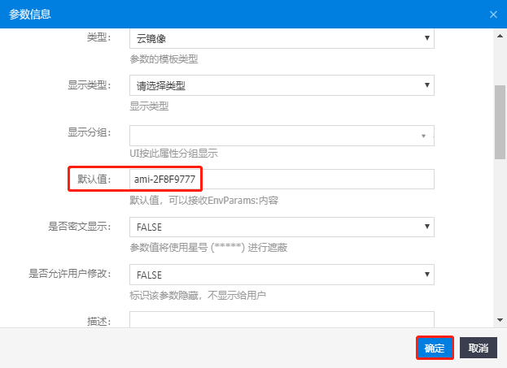
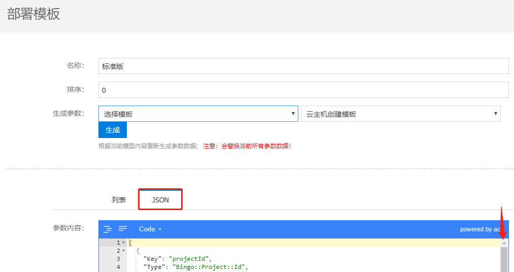
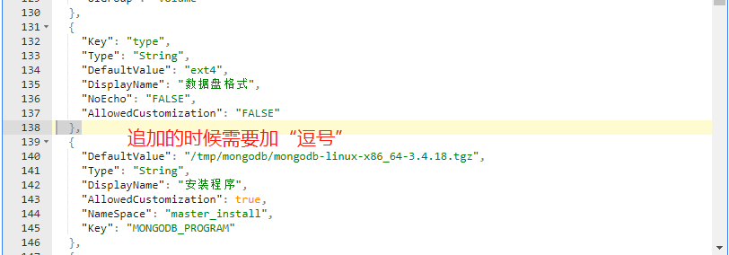

# 制作主从模式的MongoDB应用
&emsp;&emsp;本教程是面向熟悉使用SIP4.1的管理人员，需要具备看懂简单Shell脚本的能力，对SIP4.1自动化部署流程有一定的了解。若您对SIP4.1不了解，建议先学习“SIP4.1使用手册”。  
> SIP4.1使用手册（sip_user_guide_v4.1.0.20180930）：  
> http://  

### 一、安装包准备和上传
1、下载MongoDB安装程序和脚本。  
> MongoDB安装程序(mongodb_ms.tar.gz)：  
> http://  
> MongoDB-Master安装脚本(install_mongodb_master.sh)：  
> https://github.com/bcdelivery/autodeploy/blob/master/scirpts/install_mongodb_master.sh  
> MongoDB-Slave安装脚本(install_mongodb_slave.sh)：  
> https://github.com/bcdelivery/autodeploy/blob/master/scirpts/install_mongodb_slave.sh  

2、将下载好的MongoDB安装程序(mongodb_ms.tar.gz)上传到s3，设置所有人权限可读，记录url。  


3、将MongoDB-Master安装脚本(install_mongodb_master.sh)和MongoDB-Slave安装脚本(install_mongodb_slave.sh)分别新增进SIP。  


* 两个脚本都新增如下变量：  
```
MONGODHOME=${MONGODHOME}
MONGODBPATH=${MONGODBPATH}
MONGODLOGDIR=${MONGODLOGDIR}
MONGODB_PROGRAM=${MONGODB_PROGRAM}
MONGODB_MANAGE=${MONGODB_MANAGE}
MONGODB_TAR_DIR=${MONGODB_TAR_DIR}
SSHPASS=${SSHPASS}
```
* 显示名称根据需要填写，变量类型“text”，变量内容从上往下依次为：  
```
/usr/local/mongodb
/data/db
/var/log/mongo
/tmp/mongodb/mongodb-linux-x86_64-3.4.18.tgz
/tmp/mongodb/mongodb_manage_ms.sh
/tmp/mongo
/tmp/mongodb/sshpass-1.05-9.1.x86_64.rpm
```


* 将MongoDB-Master安装脚本(install_mongodb_master.sh)和MongoDB-Slave安装脚本(install_mongodb_slave.sh)分别的脚本内容全选，复制粘贴进代码框后，提交保存。  
**注意：虽然新增的两个脚本中的变量是一样的，但脚本内容是不一样的，千万不要复制粘贴错误！**  

### 二、设计方案

1、在窗口的左边有许多控件，那是“控件菜单”，从左拖拽如下图所示的控件到编辑区，然后根据下图的箭头顺序依次将控件之间的关系指引起来：  


2、点击“开始事件”，根据需要填写控件的相关信息：  
注意：红色方框内的内容必填，名称建议用英文表示。  


3、点击“安全组sg1”，根据需要填写控件的相关信息：  
注意：红色方框内的内容必填，编号、名称都用英文表示。  


4、点击“安全组sg2”，根据需要填写控件的相关信息：  


5、点击“实例master”，根据需要填写控件的相关信息：  
注意：红色方框内的内容必填，编号、名称、实例名称都用英文表示。  


6、点击“实例slave”，根据需要填写控件的相关信息：  
注意：红色方框内的内容必填，编号、名称、实例名称都用英文表示。  


7、点击“存储data1”，根据需要填写控件的相关信息：  
注意：红色方框内的内容必填，编号、名称都用英文表示，**实例ID**和**实例编号**中的填写格式是：  
> 实例ID：${outputs.<font color=#7FFF00>master</font>.instanceId}  
> 实例编号：${outputs.<font color=#7FFF00>master</font>.instanceCode}  
绿色标记的是**“实例master”控件**中的**“编号”**，必须一致。  


8、点击“存储data2”，根据需要填写控件的相关信息：  
注意：红色方框内的内容必填，编号、名称都用英文表示，**实例ID**和**实例编号**中的填写格式是：  
> 实例ID：${outputs.<font color=#7FFF00>slave</font>.instanceId}  
> 实例编号：${outputs.<font color=#7FFF00>slave</font>.instanceCode}  
绿色标记的是**“实例slave”控件**中的**“编号”**，必须一致。  


9、点击“通用指令format1”，根据需要填写控件的相关信息：  
注意：红色方框内的内容必填，编号、名称都用英文表示，**实例ID**的填写格式是：  
> 实例ID：${outputs.<font color=#7FFF00>master</font>.instanceId}  
绿色标记的是**“实例master”控件**中的**“编号”**，必须一致。  


10、点击“脚本文件”，选择格式化挂载存储卷的脚本**linux_volume_attach**：  


11、点击“通用指令format2”，根据需要填写控件的相关信息：  
注意：红色方框内的内容必填，编号、名称都用英文表示，**实例ID**的填写格式是：  
> 实例ID：${outputs.<font color=#7FFF00>slave</font>.instanceId}  
绿色标记的是**“实例slave”控件**中的**“编号”**，必须一致。  


12、点击“脚本文件”，选择格式化挂载存储卷的脚本**linux_volume_attach**：  


> linux_volume_attach脚本相关变量备注：  


13、点击“vip”，根据需要填写控件的相关信息：  
注意：红色方框内的内容必填，名称建议用英文表示。  


14、点击“vip关联实例guan1”，根据需要填写控件的相关信息：  
注意：红色方框内的内容必填，编号、名称都用英文表示，**vipId**和**实例ID**的填写格式是：  
> 实例ID：${outputs.<font color=#7FFF00>master</font>.instanceId}  
> vipId：${outputs.<font color=#7FFF00>vip</font>.vipId}  
绿色标记的分别**“vip”控件**中的**“编号”**、**“实例master”控件**中的**“实例ID”**，必须一致。  


15、点击“vip关联实例guan2”，根据需要填写控件的相关信息：  
注意：红色方框内的内容必填，编号、名称都用英文表示，**vipId**和**实例ID**的填写格式是：  
> 实例ID：${outputs.<font color=#7FFF00>slave</font>.instanceId}  
> vipId：${outputs.<font color=#7FFF00>vip</font>.vipId}  
绿色标记的分别**“vip”控件**中的**“编号”**、**“实例slave”控件**中的**“实例ID”**，必须一致。  


16、点击“自定义指令pre1”，根据需要填写控件的相关信息：  
注意：红色方框内的内容必填，编号、名称都用英文表示，**实例ID**中的填写格式是：  
> 实例ID：${outputs.<font color=#7FFF00>master</font>.instanceId}  
绿色标记的是**“实例master”控件**中的**“实例ID”**，必须一致。  


17、点击“指令内容”，输入：  
```
#!/bin/bash
wget http://10.201.83.1:81/data/mongodb_ms.tar.gz -O /tmp/mongodb_ms.tar.gz
tar -zxvf /tmp/mongodb_ms.tar.gz -C /tmp
echo "tar done" && exit 0
```
> 注意：若前面我们新增的"MongoDB安装脚本(install_mongodb_master.sh)"新增的变量内容有改变的话，如变量指定的内容不是/tmp目录，则上述指令内容中，tar需根据实际变动目录解压安装程到相应目录。  
```
MONGODB_PROGRAM=${MONGODB_PROGRAM}
MONGODB_MANAGE=${MONGODB_MANAGE}
MONGODB_MANAGE7=${MONGODB_MANAGE7}
```

18、点击“自定义指令pre2”，根据需要填写控件的相关信息：  
注意：红色方框内的内容必填，编号、名称都用英文表示，**实例ID**中的填写格式是：  
> 实例ID：${outputs.<font color=#7FFF00>slave</font>.instanceId}  
绿色标记的是**“实例slave”控件**中的**“实例ID”**，必须一致。  


19、点击“指令内容”，输入：  
```
#!/bin/bash
wget http://10.201.83.1:81/data/mongodb_ms.tar.gz -O /tmp/mongodb_ms.tar.gz
tar -zxvf /tmp/mongodb_ms.tar.gz -C /tmp
echo "tar done" && exit 0
```
> 注意：若前面我们新增的"MongoDB安装脚本(install_mongodb_slave.sh)"新增的变量内容有改变的话，如变量指定的内容不是/tmp目录，则上述指令内容中，tar需根据实际变动目录解压安装程到相应目录。  
```
MONGODB_PROGRAM=${MONGODB_PROGRAM}
MONGODB_MANAGE=${MONGODB_MANAGE}
MONGODB_MANAGE7=${MONGODB_MANAGE7}
```

20、点击“通用指令master_install”，根据需要填写控件的相关信息：  
注意：红色方框内的内容必填，编号、名称都用英文表示，**实例ID**中的填写格式是：  
> 实例ID：${outputs.<font color=#7FFF00>master</font>.instanceId}  
绿色标记的是**“实例master”控件**中的**“实例ID”**，必须一致。  


21、点击“脚本文件”，选择前面我们新创建的mongodb_master脚本：  


22、点击“通用指令slave_install”，根据需要填写控件的相关信息：  
注意：红色方框内的内容必填，编号、名称都用英文表示，**实例ID**中的填写格式是：  
> 实例ID：${outputs.<font color=#7FFF00>slave</font>.instanceId}  
绿色标记的是**“实例slave”控件**中的**“实例ID”**，必须一致。  


23、点击“脚本文件”，选择前面我们新创建的mongodb_slave脚本：  


24、点击“结束事件”，根据需要填写控件的相关信息：  

注意：红色方框内的内容必填，名称建议用英文表示。  


25、在控件区的顶部点击“保存”图标，保存编辑好的部署方案：  


### 三、参数模板

1、点击“新建模板”：  


2、填写脚相关信息，选择模板为“云主机+存储卷”，点击“生成”：  


3、在“参数列表”中，找到“imageId”，点击最右侧的“编辑”按钮：  


4、修改镜像的默认值为当前云平台“可支持自动化部署”的镜像ID：  

> tip：这里也能开启“是为允许用户修改”为“TRUE”，这样用户在部署的时候就可以指定镜像。  



5、保存对imageID的修改，点击“JSON”，将JSON编辑区拉到最下面：  



6、在原有的JSON下，新增关于mongodb_master和mongodb_slave的变量的JSON：  
```
{
    "DefaultValue": "/tmp/mongodb/mongodb-linux-x86_64-3.4.18.tgz",
    "Type": "String",
    "DisplayName": "安装程序",
    "AllowedCustomization": true,
    "NameSpace": "master_install",
    "Key": "MONGODB_PROGRAM"
  },
  {
    "DefaultValue": "/usr/local/mongodb",
    "Type": "String",
    "DisplayName": "程序家目录",
    "AllowedCustomization": true,
    "NameSpace": "master_install",
    "Key": "MONGODHOME"
  },
  {
    "DefaultValue": "/var/log/mongo",
    "Type": "String",
    "DisplayName": "日志目录",
    "AllowedCustomization": true,
    "NameSpace": "master_install",
    "Key": "MONGODLOGDIR"
  },
  {
    "DefaultValue": "/tmp/mongo",
    "Type": "String",
    "DisplayName": "临时目录",
    "AllowedCustomization": true,
    "NameSpace": "master_install",
    "Key": "MONGODB_TAR_DIR"
  },
  {
    "DefaultValue": "/tmp/mongodb/keepalived-1.2.13-6.el7.x86_64.rpm",
    "Type": "String",
    "DisplayName": "keepalived7",
    "AllowedCustomization": true,
    "NameSpace": "master_install",
    "Key": "KEEPALIVED7"
  },
  {
    "DefaultValue": "/tmp/mongodb/mongodb_manage_ms.sh",
    "Type": "String",
    "DisplayName": "管理程序",
    "AllowedCustomization": true,
    "NameSpace": "master_install",
    "Key": "MONGODB_MANAGE"
  },
  {
    "DefaultValue": "/tmp/mongodb/keepalived-1.2.13-5.el6_6.x86_64.rpm",
    "Type": "String",
    "DisplayName": "keepalived6",
    "AllowedCustomization": true,
    "NameSpace": "master_install",
    "Key": "KEEPALIVED6"
  },
  {
    "DefaultValue": "/data/db",
    "Type": "String",
    "DisplayName": "数据库目录",
    "AllowedCustomization": true,
    "NameSpace": "master_install",
    "Key": "MONGODBPATH"
  },
  {
    "DefaultValue": "/tmp/mongodb/sshpass-1.05-9.1.x86_64.rpm",
    "Type": "String",
    "DisplayName": "sshpass",
    "AllowedCustomization": true,
    "NameSpace": "master_install",
    "Key": "SSHPASS"
  },
  {
    "DefaultValue": "/tmp/mongodb/mongodb-linux-x86_64-3.4.18.tgz",
    "Type": "String",
    "DisplayName": "安装程序",
    "AllowedCustomization": true,
    "NameSpace": "slave_install",
    "Key": "MONGODB_PROGRAM"
  },
  {
    "DefaultValue": "/usr/local/mongodb",
    "Type": "String",
    "DisplayName": "程序家目录",
    "AllowedCustomization": true,
    "NameSpace": "slave_install",
    "Key": "MONGODHOME"
  },
  {
    "DefaultValue": "/var/log/mongo",
    "Type": "String",
    "DisplayName": "日志目录",
    "AllowedCustomization": true,
    "NameSpace": "slave_install",
    "Key": "MONGODLOGDIR"
  },
  {
    "DefaultValue": "/tmp/mongo",
    "Type": "String",
    "DisplayName": "临时目录",
    "AllowedCustomization": true,
    "NameSpace": "slave_install",
    "Key": "MONGODB_TAR_DIR"
  },
  {
    "DefaultValue": "/tmp/mongodb/keepalived-1.2.13-6.el7.x86_64.rpm",
    "Type": "String",
    "DisplayName": "keepalived7",
    "AllowedCustomization": true,
    "NameSpace": "slave_install",
    "Key": "KEEPALIVED7"
  },
  {
    "DefaultValue": "/tmp/mongodb/mongodb_manage_ms.sh",
    "Type": "String",
    "DisplayName": "管理程序",
    "AllowedCustomization": true,
    "NameSpace": "slave_install",
    "Key": "MONGODB_MANAGE"
  },
  {
    "DefaultValue": "/tmp/mongodb/keepalived-1.2.13-5.el6_6.x86_64.rpm",
    "Type": "String",
    "DisplayName": "keepalived6",
    "AllowedCustomization": true,
    "NameSpace": "slave_install",
    "Key": "KEEPALIVED6"
  },
  {
    "DefaultValue": "/data/db",
    "Type": "String",
    "DisplayName": "数据库目录",
    "AllowedCustomization": true,
    "NameSpace": "slave_install",
    "Key": "MONGODBPATH"
  },
  {
    "DefaultValue": "/tmp/mongodb/sshpass-1.05-9.1.x86_64.rpm",
    "Type": "String",
    "DisplayName": "sshpass",
    "AllowedCustomization": true,
    "NameSpace": "slave_install",
    "Key": "SSHPASS"
  },
  {
    "Key": "vipType",
    "Type": "String",
    "DefaultValue": "KeepAlive",
    "DisplayName": "虚拟IP类型",
    "NoEcho": "FALSE",
    "AllowedCustomization": "TRUE",
    "UIType": "text"
  }
```
注意：该json中相关变量的值需要与mongodb_master和mongodb_slave脚本中变量内容一致。  
> 补充：上述json中我们单独加了关于vip的配置。  
> 重要：注意json的格式！  




7、最后保存该参数模板：  

### 四、测试和管理

1、测试MongoDB的主从模式连接：  
**详细待补充：**  


2、管理MongoDB：  
```/etc/init.d/mongod start_master|start_slave|stop|status```

