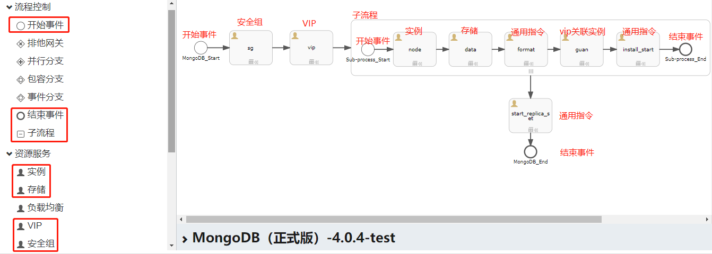
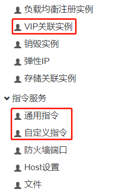
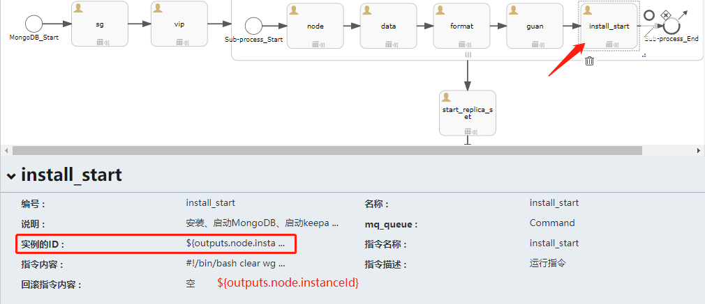
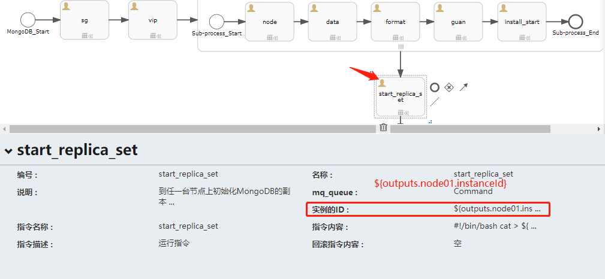

# 制作副本集群模式的MongoDB应用
&emsp;&emsp;本教程是面向熟悉使用SIP4.1的管理人员，需要具备看懂简单Shell脚本的能力，对SIP4.1自动化部署流程有一定的了解。若您对SIP4.1不了解，建议先学习“SIP4.1使用手册”。  
> SIP4.1使用手册（sip_user_guide_v4.1.0.20180930）：  
> http://  

### 一、安装包准备和上传
1、下载MongoDB安装程序和脚本。  
> MongoDB安装程序(mongodb_repl.tar.gz)：  
> http://  
> MongoDB-副本集群安装脚本(install_mongodb_replset.sh)：  
> https://github.com/bcdelivery/autodeploy/blob/master/scirpts/install_mongodb_replset.sh  
 
2、将下载好的MongoDB安装程序(mongodb_repl.tar.gz)上传到s3，设置所有人权限可读，记录url。  

### 二、设计方案

1、从左拖拽如下图所示的控件到编辑区，然后根据下图的箭头顺序依次将控件之间的关系指引起来：  





> 说明：子流程中，需要存在“开始事件”和“结束事件”。  

### 三、通用指令说明
#### 通用指令“install_start”：



> 作用：安装、启动MongoDB、启动keepalived  

#### 通用指令“start_replica_set”：



> 作用：在集群中的任一台节点上初始化mongodb副本集。  

指令内容：  
```
#!/bin/bash
cat > ${MONGODHOME}/repl.config << EOF
config = { _id:"mongo_repl", members:[tihuan]}
use admin
rs.initiate( config )
EOF

ipstr="${outputs.multi.node.privateIp}"
ipstr=${ipstr#[}
ipstr=${ipstr%]}
ipstr=(${ipstr//,/ })

json=""
i=0

for ips in ${ipstr[@]}; do
    json="$json {_id:$i,host:\"$ips:27017\"}"
	i=$[$i+1]
done
json=`echo $json | sed "s/ /,/g"`
sed -i "s/tihuan/$json/g" ${MONGODHOME}/repl.config
cat ${MONGODHOME}/repl.config | ${MONGODHOME}/bin/mongo
```
> 补充：这里我们选择在实例node01上执行初始化。如果其他实例也都需要执行该指令的内容，则需将该指令控件放入子流程中；若需要在第二台实例上执行该指令，可再添加一个控件，实例ID填写：\${outputs.node02.instanceId}，注意，使用了子流程，则内部的实例序号是从01、02、03开始的，而不是1、2、3这样的。  

### 四、脚本信息
脚本名称： ` install_mongodb_replset.sh `
脚本描述： 安装、启动MongoDB、启动keepalived。
操作系统： rhel/centos7 32/64
脚本变量：
|变量名称|显示名称|变量类型|允许用户更改|变量内容|备注|
 |------|-------|-------|------|----|----|
 |MONGODHOME|程序家目录|String|true|/usr/local/mongodb||
 |MONGODBPATH|数据库目录|String|true|ext4|/data/db||
 |MONGODLOGDIR|日志目录|String|true|/var/log/mongo||
 |MONGODB_PROGRAM|安装程序|String|true|/tmp/mongodb/mongodb-linux-x86_64-4.0.4.tgz||
 |MONGODB_TAR_DIR|临时目录|String|true|/tmp/mongo||
 |KEEPALIVED|keepalived|String|true|/tmp/mongodb/keepalived-1.2.13-6.el7.x86_64.rpm||
 |vipType|虚拟IP类型|String|true|KeepAlive||
 |NODE_NUM|集群规模(台)|Number|true|3||

### 五、参数模板

1、点击“新建模板”：  


2、填写脚相关信息，选择模板为“云主机+存储卷”，点击“生成”：  


3、在“参数列表”中，找到“imageId”，点击最右侧的“编辑”按钮：  


4、修改镜像的默认值为当前云平台“可支持自动化部署”的镜像ID：  
> **注意：该镜像必须含源，且操作系统为centos7/rhel7版本，同时安装了ec2config版本为v1.6.5以上！**  
> tip：这里也能开启“是为允许用户修改”为“TRUE”，这样用户在部署的时候就可以指定镜像。  


5、保存对imageID的修改，点击“JSON”，将JSON编辑区拉到最下面：  


6、在原有的JSON下，新增关于mongodb_master和mongodb_slave的变量的JSON：  
```
  {
    "DefaultValue": "/tmp/mongodb/mongodb-linux-x86_64-4.0.4.tgz",
    "Type": "String",
    "DisplayName": "安装程序",
    "AllowedCustomization": true,
    "NoEcho": "FALSE",
    "Key": "MONGODB_PROGRAM"
  },
  {
    "DefaultValue": "/usr/local/mongodb",
    "Type": "String",
    "DisplayName": "程序家目录",
    "AllowedCustomization": true,
    "NoEcho": "FALSE",
    "Key": "MONGODHOME"
  },
  {
    "DefaultValue": "/var/log/mongo",
    "Type": "String",
    "DisplayName": "日志目录",
    "AllowedCustomization": true,
    "NoEcho": "FALSE",
    "Key": "MONGODLOGDIR"
  },
  {
    "DefaultValue": "/tmp/mongo",
    "Type": "String",
    "DisplayName": "临时目录",
    "AllowedCustomization": true,
    "NoEcho": "FALSE",
    "Key": "MONGODB_TAR_DIR"
  },
  {
    "DefaultValue": "/tmp/mongodb/keepalived-1.2.13-6.el7.x86_64.rpm",
    "Type": "String",
    "DisplayName": "keepalived",
    "AllowedCustomization": true,
    "NoEcho": "FALSE",
    "Key": "KEEPALIVED"
  },
  {
    "DefaultValue": "/data/db",
    "Type": "String",
    "DisplayName": "数据库目录",
    "AllowedCustomization": true,
    "NoEcho": "FALSE",
    "Key": "MONGODBPATH"
  },
  {
    "Key": "vipType",
    "Type": "String",
    "DefaultValue": "KeepAlive",
    "DisplayName": "虚拟IP类型",
    "NoEcho": "FALSE",
    "AllowedCustomization": "TRUE",
    "UIType": "text"
  },
   {
    "Key": "NODE_NUM",
    "Type": "Number",
    "DefaultValue": "3",
    "DisplayName": "集群规模(台)",
    "NoEcho": "FALSE",
    "AllowedValues": [
      "3",
      "5",
      "7"
    ],
    "AllowedCustomization": "TRUE",
    "UIType": "selectbutton",
    "UIGroup": "mongodb配置"
  }
  
```
> 注意：上述json中变量的值需要与前面“自定义指令install_start”中解压（tar）到/tmp的位置一致，如若位置有变，则上述json的变量内容需根据实际变动目录解压到相应目录中。  
> 重要：注意json在添加的时候需要加“逗号”，末尾无“逗号”！  

7、最后保存该参数模板：  

8、使用MongoDB副本集模式部署的时候，建议关于变量的内容保持默认，**不建议修改！**  
