# 制作单机模式的MongoDB应用
&emsp;&emsp;本教程是面向熟悉使用SIP4.1的管理人员，需要具备看懂简单Shell脚本的能力，对SIP4.1自动化部署流程有一定的了解。若您对SIP4.1不了解，建议先学习“SIP4.1使用手册”。  
> SIP4.1使用手册（sip_user_guide_v4.1.0.20180930）：http://  

### 一、安装包准备和上传
1、下载MongoDB安装程序和脚本。  
> MongoDB安装程序(mongodb.tar.gz)：  
> http://  
> MongoDB安装脚本(install_mongodb_single.sh)：  
> https://github.com/bcdelivery/autodeploy/blob/master/scirpts/install_mongodb_single.sh  

2、将下载好的MongoDB安装程序(mongodb.tar.gz)上传到s3，设置所有人权限可读，记录url。  

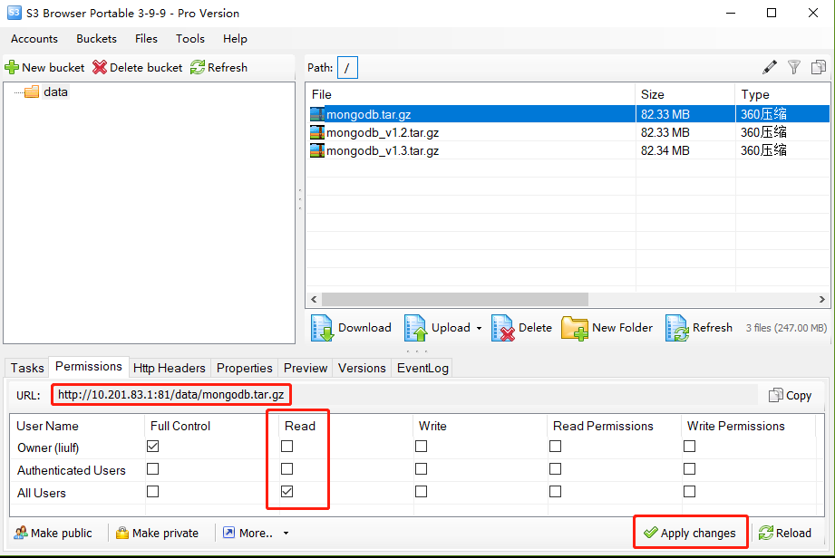

3、将MongoDB安装脚本(install_mongodb_single.sh)新增进SIP。  

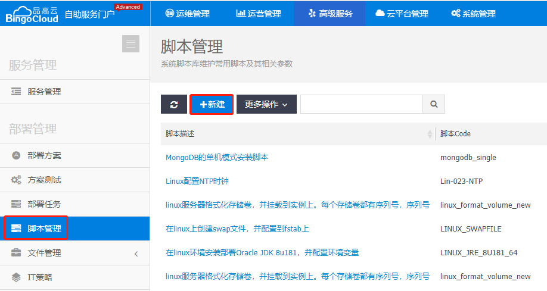

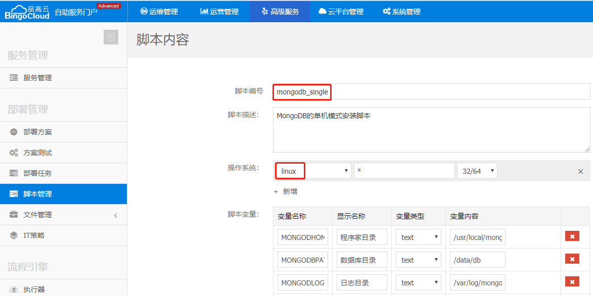

* 新增如下变量：  
```
MONGODHOME=${MONGODHOME}
MONGODBPATH=${MONGODBPATH}
MONGODLOGDIR=${MONGODLOGDIR}
MONGODB_PROGRAM=${MONGODB_PROGRAM}
MONGODB_MANAGE=${MONGODB_MANAGE}
MONGODB_MANAGE7=${MONGODB_MANAGE7}
MONGODB_TAR_DIR=${MONGODB_TAR_DIR}
```
* 显示名称根据需要填写，变量类型“text”，变量内容从上往下依次为：  
```
/usr/local/mongodb
/data/db
/var/log/mongo
/tmp/mongodb/mongodb-linux-x86_64-3.4.18.tgz
/tmp/mongodb/mongodb_manage.sh
/tmp/mongodb/mongodb_manage_rc7.sh
/tmp/mongo
```

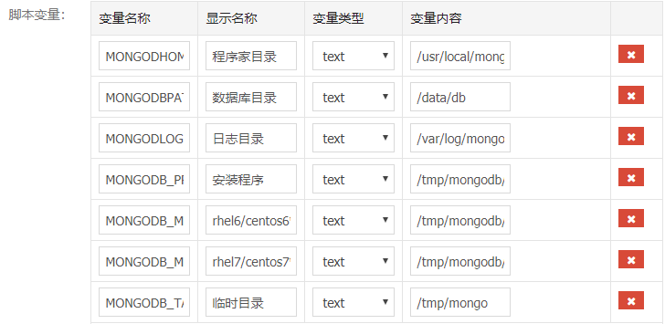

* 将MongoDB安装脚本(install_mongodb_single.sh)的脚本内容全选，复制粘贴进代码框后，提交：  

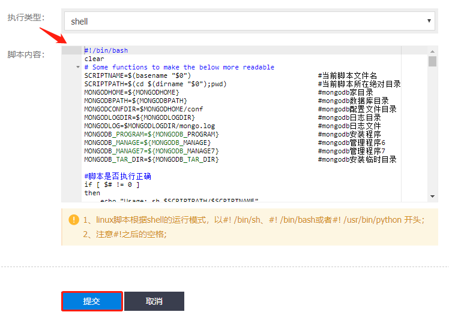

### 二、设计方案
1、在窗口的左边有许多控件，那是“控件菜单”，从左拖拽如下图所示的控件到编辑区，依次为：开始事件、安全组、实例、存储、通用指令、自定义指令、通用指令、结束事件：  

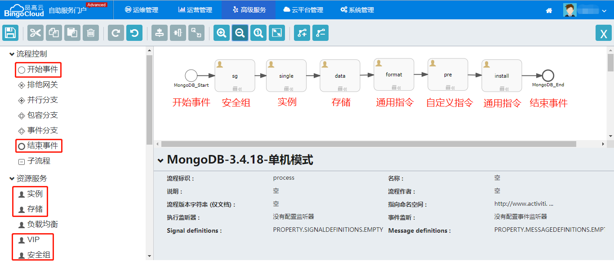

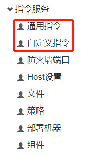

2、接着在编辑区内点击“第一个控件”，当看到控件的“右上角有个箭头”的时候，点击按住不放，拖拽到其右边的控件上，松开鼠标，即可看到两个控件间有“谁指向谁”的箭头，从左往右依次做箭头指向操作：  

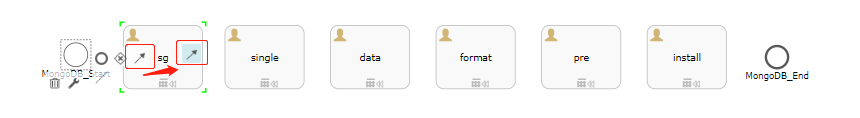

3、点击“开始事件”，根据需要填写控件的相关信息：  
注意：红色方框内的内容必填，名称建议用英文表示。  

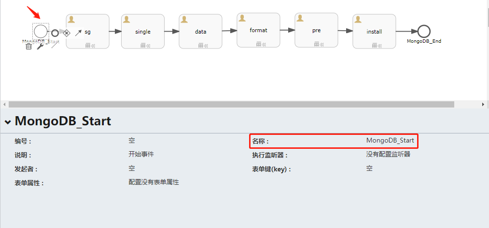

4、点击“安全组”，根据需要填写控件的相关信息：  
注意：红色方框内的内容必填，编号、名称都用英文表示。  

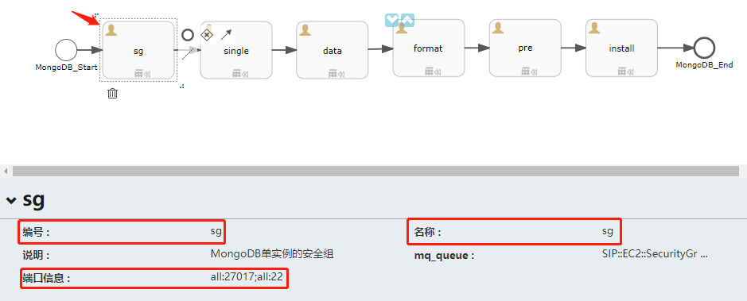

5、点击“端口信息”，根据需要开放相应协议的端口号：  

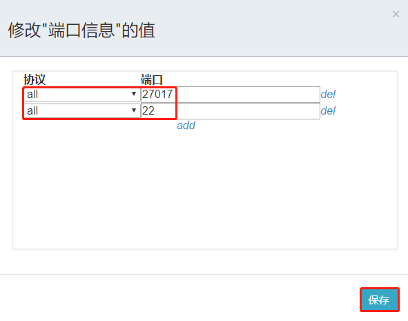

6、点击“实例”，根据需要填写控件的相关信息：  
注意：红色方框内的内容必填，编号、名称、实例名称都用英文表示。  

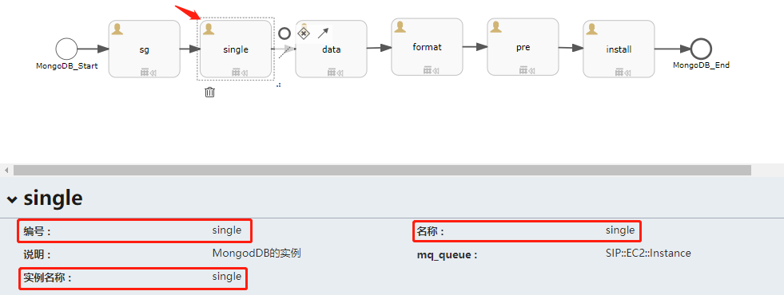

7、点击“存储”，根据需要填写控件的相关信息：  
注意：红色方框内的内容必填，编号、名称都用英文表示，**实例ID**和**实例编号**中的填写格式是：  
> 实例ID：${outputs.<font color=#7FFF00>single</font>.instanceId}  
> 实例编号：${outputs.<font color=#7FFF00>single</font>.instanceCode} 
绿色标记的是**“实例”控件**中的**“编号”**，必须一致。  

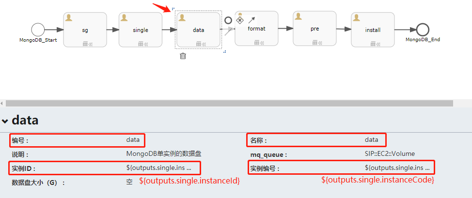

8、点击“通用指令”，根据需要填写控件的相关信息：
注意：红色方框内的内容必填，编号、名称都用英文表示，**实例ID**和**实例编号**中的填写格式是：  
> 实例ID：${outputs.<font color=#7FFF00>single</font>.instanceId}  
> 实例编号：${outputs.<font color=#7FFF00>single</font>.instanceCode}
绿色标记的是**“实例”控件**中的**“编号”**，必须一致。  

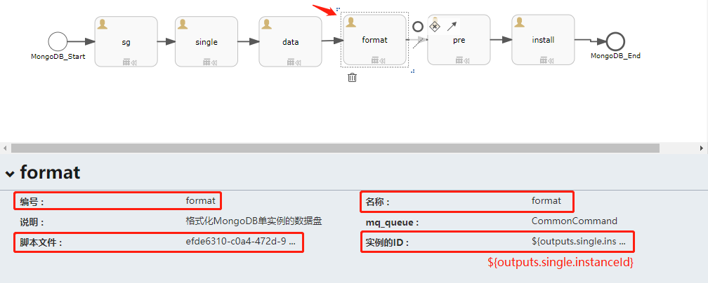

9、点击“脚本文件”，选择格式化挂载存储卷的脚本**linux_volume_attach**：  

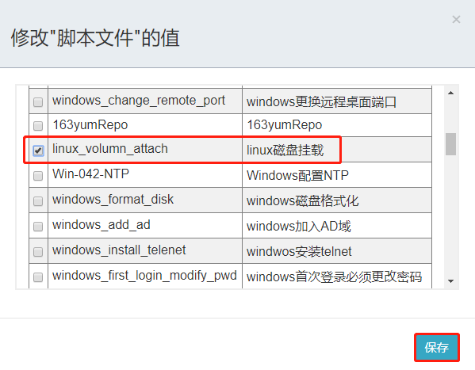

> linux_volume_attach脚本相关变量备注：  

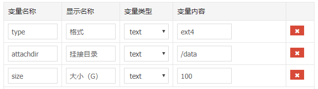

10、点击“自定义指令”，根据需要填写控件的相关信息：  
注意：红色方框内的内容必填，编号、名称都用英文表示，**实例ID**中的填写格式是：  
> 实例ID：${outputs.<font color=#7FFF00>single</font>.instanceId}  
绿色标记的是“实例”控件中的**“实例ID”**，必须一致。  

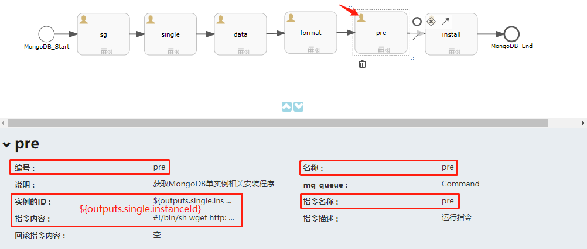

11、点击“指令内容”，输入：  
```
#!/bin/bash
wget http://10.201.83.1:81/data/mongodb.tar.gz -O /tmp/mongodb.tar.gz
tar -zxvf /tmp/mongodb.tar.gz -C /tmp
echo "tar done" && exit 0
```
> 注意：若前面我们新增的"MongoDB安装脚本(install_mongodb_single.sh)"新增的变量内容有改变的话，如变量指定的内容不是/tmp目录，则上述指令内容中，tar需根据实际变动目录解压安装程到相应目录。  
```
MONGODB_PROGRAM=\${MONGODB_PROGRAM}
MONGODB_MANAGE=\${MONGODB_MANAGE}
MONGODB_MANAGE7=\${MONGODB_MANAGE7}
```

12、点击“通用指令”，根据需要填写控件的相关信息：  
注意：红色方框内的内容必填，编号、名称都用英文表示，**实例ID**中的填写格式是：  
> 实例ID：${outputs.<font color=#7FFF00>single</font>.instanceId}  
绿色标记的是“实例”控件中的**“实例ID”**，必须一致。  

13、点击“脚本文件”，选择前面我们新创建的mongosb_single脚本：

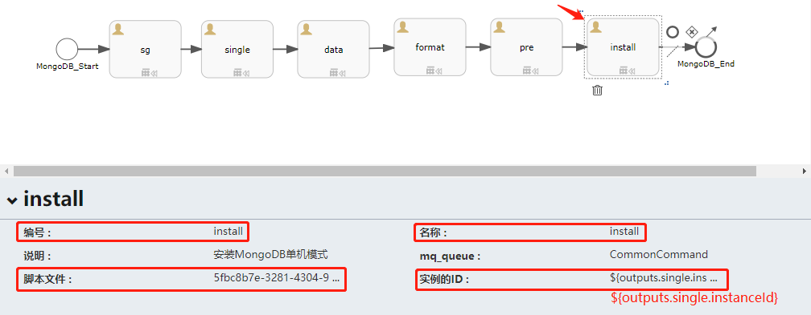

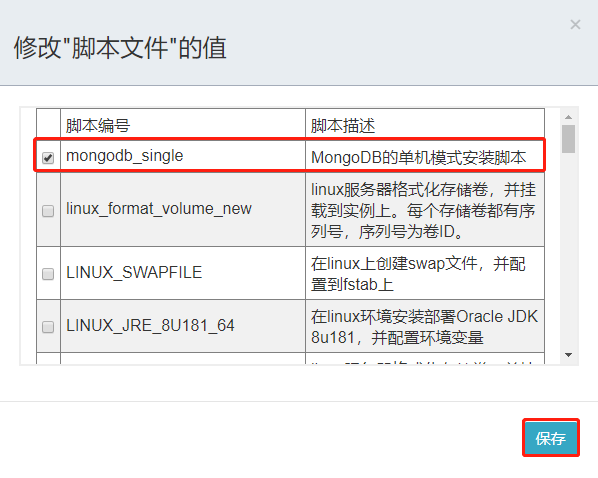

14、点击“结束事件”，根据需要填写控件的相关信息：  
注意：红色方框内的内容必填，名称建议用英文表示。  

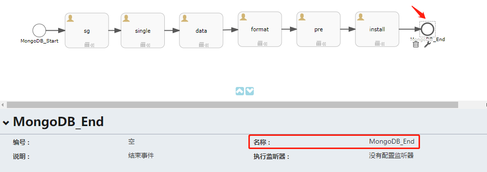

15、在控件区的顶部点击“保存”图标，保存编辑好的部署方案：  

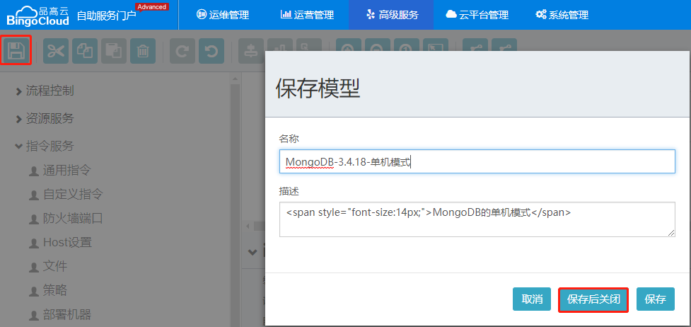

### 三、参数模板
1、点击“新建模板”：  


2、填写脚相关信息，选择模板为“云主机+存储卷”，点击“生成”：  


3、在“参数列表”中，找到“imageId”，点击最右侧的“编辑”按钮：

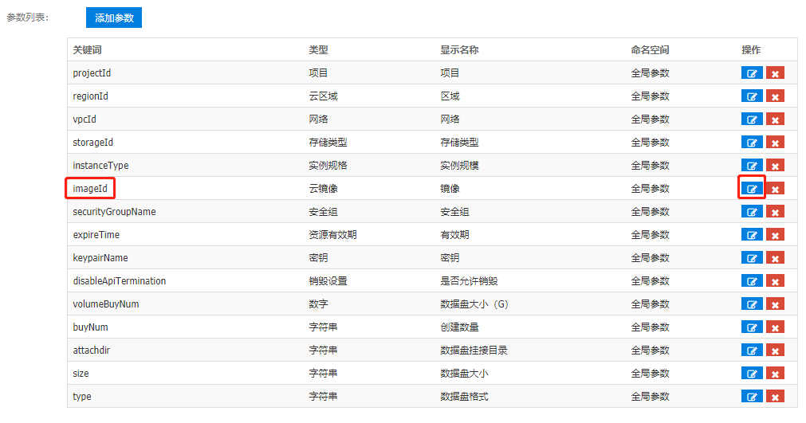

4、修改镜像的默认值为当前云平台“可支持自动化部署”的镜像ID：  
> tip：这里也能开启“是为允许用户修改”为“TRUE”，这样用户在部署的时候就可以指定镜像。  


5、保存对imageID的修改，点击“JSON”，将JSON编辑区拉到最下面：  


6、在原有的JSON下，新增关于mongodb_single的变量的JSON：  
```
{
"DefaultValue": "/tmp/mongodb/mongodb-linux-x86_64-3.4.18.tgz",
"Type": "String",
"DisplayName": "安装程序",
"AllowedCustomization": true,
"NameSpace": "install",
"Key": "MONGODB_PROGRAM"
},
{
"DefaultValue": "/usr/local/mongodb",
"Type": "String",
"DisplayName": "程序家目录",
"AllowedCustomization": true,
"NameSpace": "install",
"Key": "MONGODHOME"
},
{
"DefaultValue": "/var/log/mongo",
"Type": "String",
"DisplayName": "日志目录",
"AllowedCustomization": true,
"NameSpace": "install",
"Key": "MONGODLOGDIR"
},
{
"DefaultValue": "/tmp/mongo",
"Type": "String",
"DisplayName": "临时目录",
"AllowedCustomization": true,
"NameSpace": "install",
"Key": "MONGODB_TAR_DIR"
},
{
"DefaultValue": "/tmp/mongodb/mongodb_manage.sh",
"Type": "String",
"DisplayName": "rhel6/centos6管理程序",
"AllowedCustomization": true,
"NameSpace": "install",
"Key": "MONGODB_MANAGE"
},
{
"DefaultValue": "/data/db",
"Type": "String",
"DisplayName": "数据库目录",
"AllowedCustomization": true,
"NameSpace": "install",
"Key": "MONGODBPATH"
},
{
"DefaultValue": "/tmp/mongodb/mongodb_manage_rc7.sh",
"Type": "String",
"DisplayName": "rhel7/centos7管理程序",
"AllowedCustomization": true,
"NameSpace": "install",
"Key": "MONGODB_MANAGE7"
}
```
注意：该json中相关变量的值需要与mongodb_single脚本中变量内容一致。  
> 重要：注意json的格式！  

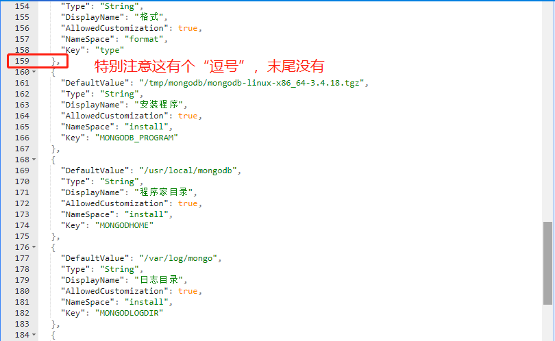

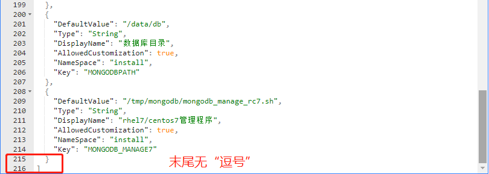

7、最后保存该参数模板：

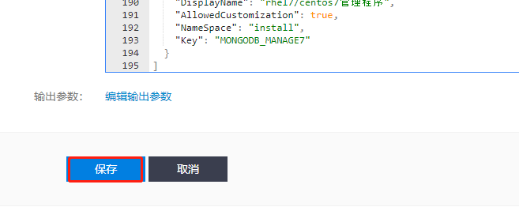

### 四、测试部署结果
1、测试MongoDB的单机模式连接：  


2、结束  

