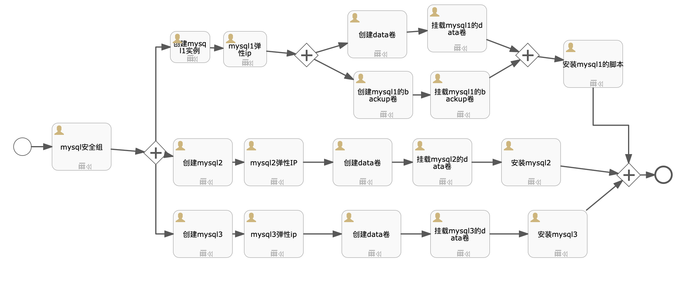

# 目标
MySQL是一个关系型数据库管理系统，由瑞典MySQL AB 公司开发，目前属于 Oracle 旗下公司。MySQL 最流行的关系型数据库管理系统，在 WEB 应用方面MySQL是最好的 RDBMS (Relational Database Management System，关系数据库管理系统) 应用软件之一。

本方案采用Percona XtraDB Cluster构建MySQL高可用性和可扩展性解决方案，Percona XtraDB Cluster提供的特性如下：
1. 同步复制，事务要么在所有节点提交或不提交。
2. 多主复制，可以在任意节点进行写操作。
3. 在从服务器上并行应用事件，真正意义上的并行复制。
4. 节点自动配置。
5. 数据一致性，不再是异步复制。

假设读者知道`sip`中如何创建自动化部署方案，本文只描述自动化部署方案内容，如何创建自动化部署方案请参考`sip`使用手册。

# 模型

本模型分为2个步骤,3个分支：
* mysql安全组: 资源类型为`安全组`，编号为`mysql_sg`，端口信息为`tcp:22,3306,4444,4567,4568;udp:4567`
* 并行分支1:
  - 创建mysql1实例：资源类型为`实例`, 编号为`mysql1_instance`
  - 申请弹性IP：资源类型为`弹性IP`, 编号为`mysql1_eip`，实例ID为`${outputs.mysql1_instance.instanceId}`
  - 并行分支1.1:
    * 数据盘：资源类型为`存储`, 编号为`data_mysql1_volume`，实例ID为`${outputs.mysql1_instance.instanceId}`,实例编号为`${outputs.mysql1_instance.instanceCode}`
    * 挂载数据盘：资源类型为`通用脚本`, 脚本为`linux_format_volume`,编号为`mount_data_mysql1_volume`，实例ID为`${outputs.mysql1_instance.instanceId}`
  - 并行分支1.2:
    * 数据盘：资源类型为`存储`, 编号为`backup_mysql1_volume`，实例ID为`${outputs.mysql1_instance.instanceId}`,实例编号为`${outputs.mysql1_instance.instanceCode}`
    * 挂载数据盘：资源类型为`通用脚本`, 脚本为`linux_format_volume`,编号为`mount_backup_mysql1_volume`，实例ID为`${outputs.mysql1_instance.instanceId}`
  - 安装mysql: 资源类型为`组件`, 编号为`install_mysql1`，组件名称`mysql`,安装脚本为下面的脚本`install_mysql_cluster1.sh`
* 并行分支2:
  - 创建mysql实例：资源类型为`实例`, 编号为`mysql2_instance`
  - 申请弹性IP：资源类型为`弹性IP`, 编号为`mysql2_eip`，实例ID为`${outputs.mysql2_instance.instanceId}`
  - 数据盘：资源类型为`存储`, 编号为`data_mysql2_volume`，实例ID为`${outputs.mysql2_instance.instanceId}`,实例编号为`${outputs.mysql2_instance.instanceCode}`
  - 挂载数据盘：资源类型为`通用脚本`, 脚本为`linux_format_volume`,编号为`mount_data_mysql2_volume`，实例ID为`${outputs.mysql2_instance.instanceId}`
  - 安装mysql2: 资源类型为`组件`, 编号为`install_mysql2`，组件名称`mysql`,安装脚本为下面的脚本`install_mysql_cluster2.sh`
* 并行分支3:
  - 创建mysql实例：资源类型为`实例`, 编号为`mysql3_instance`
  - 申请弹性IP：资源类型为`弹性IP`, 编号为`mysql3_eip`，实例ID为`${outputs.mysql3_instance.instanceId}`
  - 数据盘：资源类型为`存储`, 编号为`data_mysql3_volume`，实例ID为`${outputs.mysql3_instance.instanceId}`,实例编号为`${outputs.mysql3_instance.instanceCode}`
  - 挂载数据盘：资源类型为`通用脚本`, 脚本为`linux_format_volume`,编号为`mount_data_mysql3_volume`，实例ID为`${outputs.mysql3_instance.instanceId}`
  - 安装mysql: 资源类型为`组件`, 编号为`install_mysql3`，组件名称`mysql`,安装脚本为下面的脚本`install_mysql_cluster3.sh`

# 文件准备
需要在S3的`bingoinstall`桶中将下列文件上传，并且开通下载能力。
* 5.6.40：`mysql-5.6.40.zip`(数据库安装文件，必须),这个安装包种集成了依赖的rpm包。

# 输入参数

* MYSQLDATAPATH: MYSQL数据路径
* MYSQLBACKUPPATH: MYSQL备份数据路径
* MYSQLCLUSTERNAME: MYSQL集群名称
* MYSQLROOTPASSWD: MYSQL ROOT密码
* MYSQLSSTPASSWD: MYSQL SST密码
* MYSQLBACKUPKEEP: MYSQL 备份保留周期
* MYSQLURL：s3安装路径，例如http://169.254.169.254:8683/bingoinstall/mysql-5.6.40.zip

[import lang:"json"](../parameters/parameters.mysql_cluster.5.6.40.json)
# 输出参数
[import lang:"json"](../parameters/outputs.mysql_cluster.5.6.40.json)

# 脚本内容

## install_mysql_cluster1.sh
[import lang:"sh"](../scirpts/install_mysql_cluster1.sh)

## install_mysql_cluster2.sh
[import lang:"sh"](../scirpts/install_mysql_cluster2.sh)

## install_mysql_cluster3.sh
[import lang:"sh"](../scirpts/install_mysql_cluster3.sh)