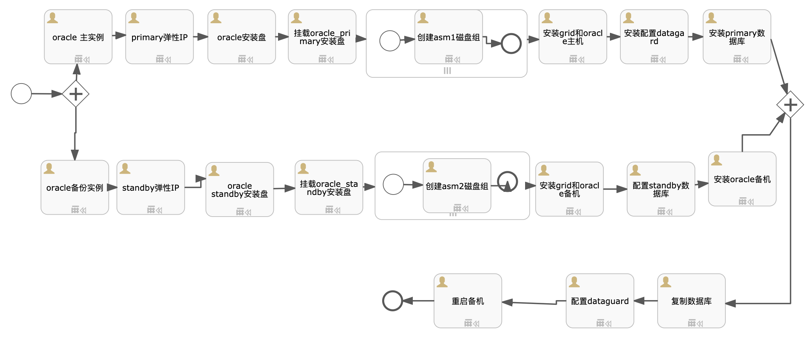

# 目标
本文介绍Oracle 12c系列（12.2.0.1和12.1.0.2）ative dataguard在RHEL6.x、CentOS6.X服务器上的安装过程，使用Oracle的ASM作为存储管理系统，启用emcontrol进行虚拟机管理。data guard 主要用于确保企业数据的高可用，数据保护和容灾恢复。典型的配置包含一个主库和一个或若干个备库。主库用于正常的企业操作使用，并且将redo 数据传送到备库中。

假设读者知道`sip`中如何创建自动化部署方案，本文只描述自动化部署方案内容，如何创建自动化部署方案请参考`sip`使用手册。

# 模型

本模型分为3个大过程：
* 安装Oracle Primary实例：创建Oracle primary实例、创建和挂载oracle安装盘、添加ASM盘、安装grid组建、安装并初始化oracle数据库
* 安装Oracle Standby实例：创建Oracle standby实例、创建和挂载oracle安装盘、添加ASM盘、安装grid组建、安装oracle数据库
* 创建standby实例：复制数据库到standby实例、配置dataguard信息、重启恢复服务

具体模型流程：
* 并行分支1：安装Oracle Primary实例
    - 创建Oracle实例：资源类型为`实例`, 编号为`oracle_primary`
    - 申请Oracle弹性IP：资源类型为`弹性IP`, 编号为`oracle_primary_eip`，实例ID为`${outputs.oracle_primary.instanceId}`
    - 申请Oracle安装volume：资源类型为`存储`, 编号为`oracle_primary_install_volume`，实例ID为`${outputs.oracle_primary.instanceId}`,实例编号为`${outputs.oracle_primary.instanceCode}`
    - 挂载Oracle安装volume：资源类型为`通用脚本`, 脚本为`linux_format_volume`,编号为`mount_oracle_primary_install_volume`，实例ID为`${outputs.oracle_primary.instanceId}`
    - 创建磁盘子流程： 资源类型为`子流程`, 编号为`asm1_sp`，多实例类型为`Parallel`, 基数为`${volumenum}`
        * 创建asm磁盘：资源类型为`存储`, 编号为`asm1`，实例ID为`${outputs.oracle_primary.instanceId}`,实例编号为`${outputs.oracle_primary.instanceCode}`
    - 安装Oracle grid组件: 资源类型为`自定义指令`, 编号为`install_oracle_grid_primary`，名称为`安装grid和oracle主机`,说明为`安装grid asm、安装补丁，安装oracle，创建数据库`,实例ID为`${outputs.oracle_primary.instanceId}`,脚本参见下面内容`install_oracle_dg_primary.sh`
    - 配置primary数据库的dataguard: 资源类型为`自定义指令`, 编号为`config_primary_dataguard`，名称为`安装配置datagard`,实例ID为`${outputs.oracle_primary.instanceId}`,脚本参见下面内容`install_oracle_dg_primary_step2.sh`
    - 安装Oracle组件: 资源类型为`组件`, 编号为`install_oracle_primary`，名称为`安装primary数据库`,组件名称为`oracle 12c`,组件描述`oracle 12c primary 数据库`,实例ID为`${outputs.oracle_primary.instanceId}`,脚本参见下面内容`install_oracle_dg_primary_step6.sh`
* 并行分支2：安装Oracle Standby实例
    - 创建Oracle实例：资源类型为`实例`, 编号为`oracle_standby`
    - 申请Oracle弹性IP：资源类型为`弹性IP`, 编号为`oracle_standby_eip`，实例ID为`${outputs.oracle_standby.instanceId}`
    - 申请Oracle安装volume：资源类型为`存储`, 编号为`oracle_standby_install_volume`，实例ID为`${outputs.oracle_standby.instanceId}`,实例编号为`${outputs.oracle_standby.instanceCode}`
    - 挂载Oracle安装volume：资源类型为`通用脚本`, 脚本为`linux_format_volume`,编号为`mount_oracle_standby_install_volume`，实例ID为`${outputs.oracle_standby.instanceId}`
    - 创建磁盘子流程： 资源类型为`子流程`, 编号为`asm2_sp`，多实例类型为`Parallel`, 基数为`${volumenum}`
        * 创建asm磁盘：资源类型为`存储`, 编号为`asm2`，实例ID为`${outputs.oracle_standby.instanceId}`,实例编号为`${outputs.oracle_standby.instanceCode}`
    - 安装Oracle grid组件: 资源类型为`自定义指令`, 编号为`install_oracle_grid_standby`，名称为`安装grid和oracle主机`,实例ID为`${outputs.oracle_standby.instanceId}`,脚本参见下面内容`install_oracle_dg_standby.sh`
    - 配置primary数据库的dataguard: 资源类型为`自定义指令`, 编号为`config_standby_dataguard`，名称为`配置standby数据库`,实例ID为`${outputs.oracle_standby.instanceId}`,脚本参见下面内容`install_oracle_dg_standby_step2.sh`
    - 安装Oracle组件: 资源类型为`组件`, 编号为`install_standby`，名称为`安装oracle备机`,组件名称为`oracle 12c`,组件描述`oracle 12c standby 数据库`,实例ID为`${outputs.oracle_standby.instanceId}`,脚本参见下面内容`install_oracle_dg_standby_step3.sh`
* 创建standby实例:
    - 复制数据库: 资源类型为`自定义指令`, 编号为`rman_duplicate`，名称为`复制数据库`,实例ID为`${outputs.oracle_standby.instanceId}`,脚本参见下面内容`install_oracle_dg_standby_step3_rman.sh`
    - 配置dataguard: 资源类型为`自定义指令`, 编号为`config_dataguard`，名称为`配置dataguard`,实例ID为`${outputs.oracle_primary.instanceId}`,脚本参见下面内容`install_oracle_dg_primary_step6.sh`
    - 重启备机: 资源类型为`自定义指令`, 编号为`reboot_standby`，名称为`重启备机`,实例ID为`${outputs.oracle_standby.instanceId}`,脚本参见下面内容`install_oracle_dg_standby_step7.sh`
# 文件准备
需要在S3的`bingoinstall`桶中将下列文件上传，并且开通下载能力。
* 12.2.0.1:`p27475613_122010_Linux-x86-64.zip`(数据库安装文件，必须),`linuxx64_12201_grid_home.zip`(grid安装文件,必须),`p6880880_122010_Linux-x86-64.zip`(可选，OPatch补丁文件),`p27468969_122010_Linux-x86-64.zip`(可选),`p27475613_122010_Linux-x86-64.zip`(可选)
* 12.1.0.2：`linuxamd64_12102_database_1of2.zip`(数据库安装文件，必须),`linuxamd64_12102_database_2of2.zip`(数据库安装文件，必须),`linuxamd64_12102_grid_1of2.zip`(grid安装文件,必须),`linuxamd64_12102_grid_2of2.zip`(grid安装文件,必须)

以上文件可以在[www.oracle.com](https://www.oracle.com/cn/database/products.html)下载，请保持原样上传。

# 输入参数

* ORACLEUSER: oracle用户
* GRIDUSER: grid用户
* ORACLEPATH: oracle安装路径
* ORACLESID: oracle sid
* ORACLEURL: oracle安装文件路径
* ORACLEPASSWD: oracle密码
* GRIDURL: grid安装文件路径
* ORACLE_VERSION: oracle安装版本，12.2.0.1，12.1.0.2
* GRID_PATCH: grid补丁文件包名称列表，英文逗号分隔
* ORACLE_PATCH: oracle补丁文件包名称列表，英文逗号分隔
* ORACLE_CHARACTER: oracle字符集
* INSTALLER_S3_BUCKET：s3路径，例如http://169.254.169.254:8683/bingoinstall

[import lang:"json"](../parameters/parameters.oracle_adg.12.2.0.1.json)
# 输出参数
[import lang:"json"](../parameters/outputs.oracle_adg.12.2.0.1.json)
# 服务使用
启用EM Express
在12c种已经不在通过emctl进行控制台管理，通过EM Express进行管理。
使用`oracle`用户登录到服务器，执行
```sql
sqlplus "/as sysdba"
dbms_xdb_config.sethttpport(5500);
exit
```
访问http://ip:5500/em即可以访问。
# 脚本内容

## install_oracle_dg_primary.sh
[import lang:"sh"](../scirpts/install_oracle_dg_primary.sh)

## install_oracle_dg_primary_step2.sh
[import lang:"sh"](../scirpts/install_oracle_dg_primary_step2.sh)

## install_oracle_dg_standby.sh
[import lang:"sh"](../scirpts/install_oracle_dg_standby.sh)

## install_oracle_dg_standby_step2.sh
[import lang:"sh"](../scirpts/install_oracle_dg_standby_step2.sh)

## install_oracle_dg_standby_step3
```sh
#! /bin/sh
echo "完成安装standby"
```

## install_oracle_dg_standby_step3_rman.sh
[import lang:"sh"](../scirpts/install_oracle_dg_standby_step3_rman.sh)

## install_oracle_dg_primary_step6.sh
[import lang:"sh"](../scirpts/install_oracle_dg_primary_step6.sh)

## install_oracle_dg_standby_step7.sh
[import lang:"sh"](../scirpts/install_oracle_dg_standby_step7.sh)