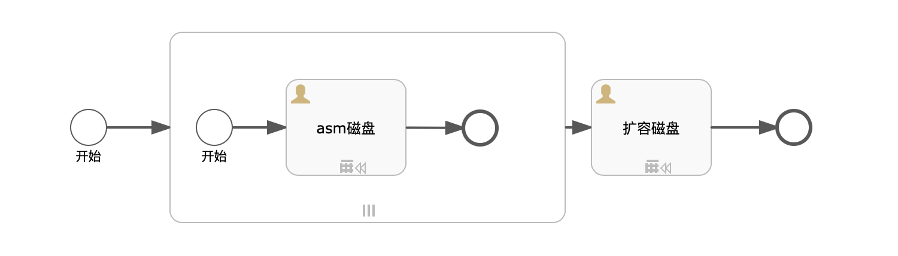

# 目标
本文介绍Oracle 12c系列（12.2.0.1和12.1.0.2）通过ASM扩展磁盘的运维方案，帮助使用者快速扩容磁盘。  
假设读者知道`sip`中如何创建自动化部署方案，本文只描述自动化部署方案内容，如何创建自动化部署方案请参考`sip`使用手册。

# 模型

本模型主要为一个为子流程创建asm磁盘，一个添加磁盘的组件步骤：
* 创建磁盘子流程： 资源类型为`子流程`, 多实例类型为`Parallel`, 基数为`${volumenum}`
    - 创建asm磁盘：资源类型为`存储`, 编号为`asm`，实例ID为`${Oracle.instanceId}`,实例编号`${Oracle.instanceCode}`
* 安装Oracle组件: 资源类型为`组件`, 编号为`extend_asm`，实例ID为`${Oracle.instanceId}`,安装脚本为下面的脚本

# 文件准备
此运维方案无需准备文件。

以上文件可以在[www.oracle.com](https://www.oracle.com/cn/database/products.html)下载，请保持原样上传。

# 输入参数
本运维方案中使用到了`函数`来获取在创建服务时所使用到的`输出参数`。比如参数中的变量Oracle通过函数最终编程对象{"Oracle":{"instanceId":"xxxxxxx-sss-ss-eeeee","instanceCode":"i-xxxxxxxx"}},在脚本中可以正常访问该对象。
Fn::GetAppEnv函数可以获取部署案例的EnvId，Fn::GetAtt通过获取的AppEnv来获取createProcessInstanceId，Fn::GetProcessOutputs来获取对应Namespace里面的变量。

* ORACLEUSER: oracle用户
[import lang:"json"](../parameters/parameters.extend_oracle_asm.json)
# 输出参数
本运维方案无输出参数
# 脚本内容

[import lang:"sh"](../scirpts/maintain_extend_oracle_asm_single.sh)
