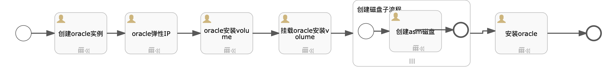

# 目标
本文介绍Oracle 12c系列（12.2.0.1和12.1.0.2standalone在RHEL6.x、CentOS6.X服务器上的安装过程，使用Oracle的ASM作为存储管理系统，启用emcontrol进行虚拟机管理。如果数据库版本为12.2.0.1，会自动去S3中下载补丁文件`p6880880_122010_Linux-x86-64.zip`,`p27468969_122010_Linux-x86-64.zip`,`p27475613_122010_Linux-x86-64.zip`  
假设读者指导`sip`中如何创建自动化部署方案，本文只描述自动化部署方案内容，如何创建自动化部署方案请参考`sip`使用手册。

# 模型

### ASM子流程 

# 文件准备
需要在S3的`bingoinstall`桶中将下列文件上传，并且开通下载能力。
* 12.2.0.1:`p27475613_122010_Linux-x86-64.zip`(数据库安装文件，必须),`linuxx64_12201_grid_home.zip`(grid安装文件,必须),`p6880880_122010_Linux-x86-64.zip`(可选，OPatch补丁文件),`p27468969_122010_Linux-x86-64.zip`(可选),`p27475613_122010_Linux-x86-64.zip`(可选)
* 12.1.0.2：`linuxamd64_12102_database_1of2.zip`(数据库安装文件，必须),`linuxamd64_12102_database_2of2.zip`(数据库安装文件，必须),`linuxamd64_12102_grid_1of2.zip`(grid安装文件,必须),`linuxamd64_12102_grid_2of2.zip`(grid安装文件,必须)

以上文件可以在[www.oracle.com](https://www.oracle.com/cn/database/products.html)下载，请保持原样上传。

# 输入参数

* ORACLEUSER: oracle用户
* GRIDUSER: grid用户
* ORACLEPATH: oracle安装路径
* ORACLESID: oracle sid
* ORACLEURL: oracle安装文件路径
* ORACLEPASSWD: oracle密码
* GRIDURL: grid安装文件路径
* ORACLE_VERSION: oracle安装版本，12.2.0.1，12.1.0.2
* ORACLE_CHARACTER: oracle字符集
* INSTALLER_S3_BUCKET：s3路径，例如http://169.254.169.254:8683/bingoinstall

[import lang:"json"](../parameters/parameters.oracle_single.12.2.0.1.json)
# 输出参数
[import lang:"json"](../parameters/outputs.oracle_single.12.2.0.1.json)
# 服务使用

# 脚本内容

[import lang:"sh"](../scirpts/install_oracle_single.sh)
