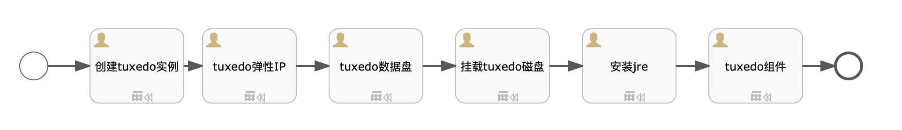

# 目标
本文介绍Oracle tuxedo中间件在RHEL6.x、CentOS6.X服务器上的安装过程，会自动去S3中下载补丁文件。
假设读者知道`sip`中如何创建自动化部署方案，本文只描述自动化部署方案内容，如何创建自动化部署方案请参考`sip`使用手册。

# 模型

本模型分为6个步骤：
* 创建tuxedo实例：资源类型为`实例`, 编号为`tuxedo_instance`
* tuxedo弹性IP：资源类型为`弹性IP`, 编号为`tuxedo_eip`，实例ID为`${outputs.tuxedo_instance.instanceId}`
* tuxedo数据盘：资源类型为`存储`, 编号为`tuxedo_volume`，实例ID为`${outputs.tuxedo_instance.instanceId}`,实例编号为`${outputs.tuxedo_instance.instanceCode}`
* 挂载tuxedo磁盘：资源类型为`通用脚本`, 脚本为`linux_format_volume`,编号为`mount_tuxedo_script`，实例ID为`${outputs.tuxedo_instance.instanceId}`
* 安装jre：资源类型为`通用脚本`, 脚本为`LINUX_JRE_8U181_64`,编号为`mount_tuxedo_script`，实例ID为`${outputs.tuxedo_instance.instanceId}`
* tuxedo组件: 资源类型为`组件`, 编号为`tuxedo_com`，组件名称`tuxedo`,安装目录为`${TUXEDOPATH}`,安装脚本为下面的脚本`install_tuxedo.sh`

# 文件准备
需要在S3的`bingoinstall`桶中将下列文件上传，并且开通下载能力。
* 12.2.2:`tuxedo122200_64_Linux_01_x86.zip`(安装文件，必须)
* 12.1.3：`tuxedo121300_64_Linux_01_x86.zip`(安装文件，必须)

# 输入参数

* USERNAME: tuxedo安装用户
* USERGROUP: tuxedo安组装用户
* TUXEDOPATH: tuxedo安装路径，确保有空间
* TUXEDOPASSWD: tuxedo监听密码
* TUXEDOURL: tuxedo安装文件路径
* TUXEDOVERSION: tuxedo安装版本，现在支持12.2.2.0.0，12.1.3.0.0
* PATCHURL: patch补丁地址

[import lang:"json"](../parameters/parameters.tuxedo_12.2.2.json)
# 输出参数
[import lang:"json"](../parameters/outputs.tuxedo_12.2.2.json)

# 脚本内容

## install_tuxedo.sh
[import lang:"sh"](../scirpts/install_tuxedo.sh)
