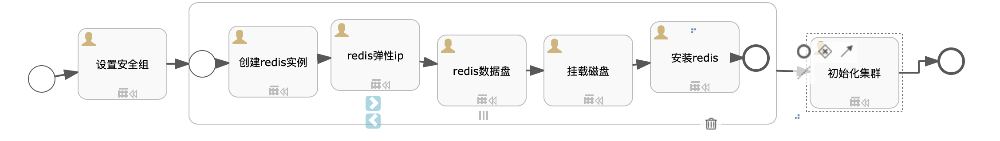

# 目标
Redis是一个开源的使用ANSI C语言编写、支持网络、可基于内存亦可持久化的日志型、Key-Value数据库，并提供多种语言的API。从2010年3月15日起，Redis的开发工作由VMware主持。从2013年5月开始，Redis的开发由Pivotal赞助。

本文介绍Redis 3.x、4.x`集群`在RHEL6.x、CentOS6.X服务器上的安装过程，会自动去S3中下载补丁文件。
假设读者知道`sip`中如何创建自动化部署方案，本文只描述自动化部署方案内容，如何创建自动化部署方案请参考`sip`使用手册。

# 模型

本模型分为3大步骤，其中第二步骤为子流程步骤：
* redis_sg: 资源类型为`安全组`，编号为`redis_sg`，端口信息为`tcp:22,7000,7001,7002,7003,7004,7005;tcp:17000,17001,17002,17003,17004,17005`
* 子流程：资源类型为`子流程`, 多实例类型为`Parallel`, 基数为`${REDISSERVER}`
  - 创建redis实例：资源类型为`实例`, 编号为`redis`
  - 弹性IP：资源类型为`弹性IP`, 编号为`redis_eip`，实例ID为`${outputs.redis.instanceId}`
  - redis数据盘：资源类型为`存储`, 编号为`data_redis_volume`，实例ID为`${outputs.redis.instanceId}`,实例编号为`${outputs.redis.instanceCode}`
  - 挂载数据盘：资源类型为`通用脚本`, 脚本为`linux_format_volume`,编号为`mount_data_redis_volume`，实例ID为`${outputs.redis.instanceId}`
  - 安装redis: 资源类型为`组件`, 编号为`install_redis`，组件名称`redis`,安装目录为`${REDISDATAPATH}`,端口为`6379`,安装脚本为下面的脚本`install_redis_cluster.sh`
* 初始化：资源类型`自定义脚本`，编号为`init_cluster`，实例ID为`${outputs.redis.instanceId}`,安装脚本为下面的脚本`install_redis_cluster.sh`

# 文件准备
需要在S3的`bingoinstall`桶中将下列文件上传，并且开通下载能力。
* 3.2.12:`redis-3.2.12.zip`(安装文件，必须)
* 4.0.11：`redis-4.0.11.zip`(安装文件，必须)

# 输入参数

* REDISDATAPATH: REDIS数据路径
* REDISSERVER: redis服务器数量
* REDISURL：s3安装路径，例如http://169.254.169.254:8683/bingoinstall/redis-4.0.11.zip

[import lang:"json"](../parameters/parameters.redis_cluster.4.0.11.json)
# 输出参数
[import lang:"json"](../parameters/outputs.redis_cluster.4.0.11.json)

# 脚本内容

## install_redis_cluster.sh
[import lang:"sh"](../scirpts/install_redis_cluster.sh)
